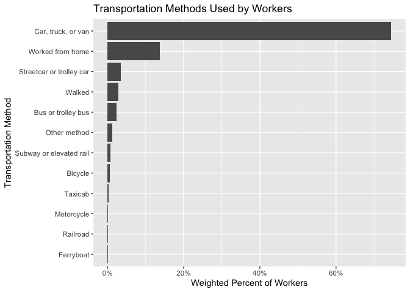
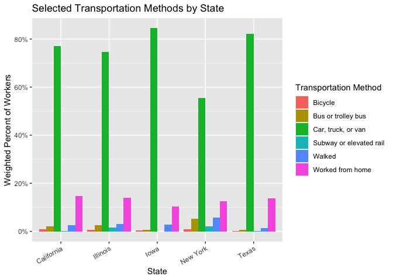
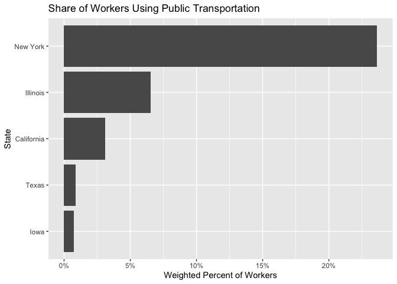
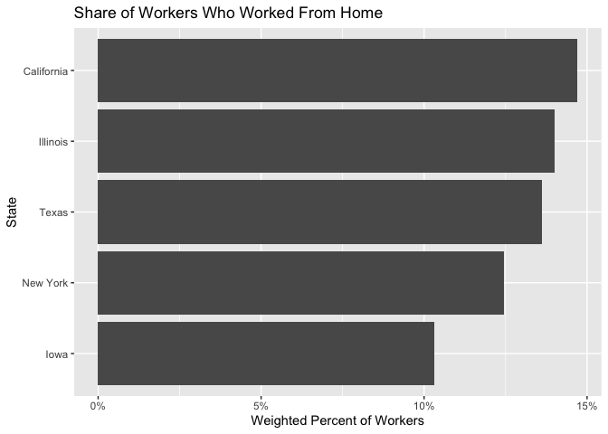
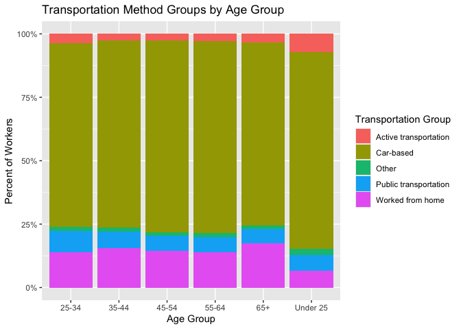
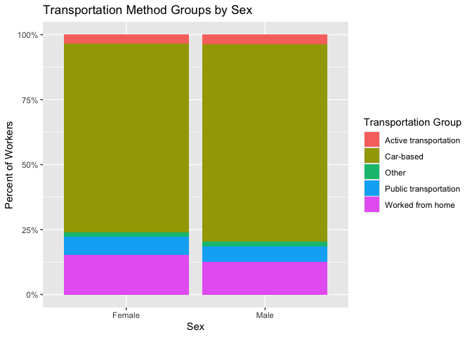

Transportation Methods Used by Workers Across U.S. States
================
Shreya Nallapeta
2026-07-10

``` r
library(tidyverse)
library(tidycensus)
library(scales)
library(knitr)
```

# Introduction

Transportation is part of everyday life for workers. Some workers drive,
some use public transportation, some walk or bike, and some work from
home. These choices can be related to location, age, sex, access to
public transportation, and work opportunities.

For this project, I analyze transportation methods used by workers
across selected U.S. states using the American Community Survey Public
Use Microdata Sample, also known as ACS PUMS. The selected states are
Iowa, California, New York, Texas, and Illinois.

The goal of this project is to explore how workers travel to work and
whether transportation methods differ by state, age group, and sex.

# Team Member

This project was completed individually by Shreya Nallapeta.

# Research Questions

This project addresses the following questions:

1.  What transportation methods are most commonly used by workers in the
    selected U.S. states?
2.  How do transportation methods differ across Iowa, California, New
    York, Texas, and Illinois?
3.  Which states have higher shares of public transportation use and
    working from home?
4.  How do transportation methods vary by age group?
5.  How do transportation methods vary by sex?

# Data

The dataset used for this project is the **American Community Survey
1-Year Public Use Microdata Sample**, also known as **ACS PUMS**.

Dataset source: U.S. Census Bureau ACS PUMS

Dataset link:
<https://www.census.gov/programs-surveys/acs/microdata.html>

ACS PUMS contains person-level and household-level records. This dataset
is useful for this project because it includes worker characteristics,
commuting method, age, sex, state, and survey weights.

The main variables used in this project are:

| Variable     | Description                             |
|--------------|-----------------------------------------|
| `JWTRNS`     | Means of transportation to work         |
| `AGEP`       | Age                                     |
| `SEX`        | Sex                                     |
| `PWGTP`      | Person-level survey weight              |
| `ESR`        | Employment status                       |
| `state_abbr` | State abbreviation added during loading |

# Data Loading

The code checks whether the raw data file already exists in the `data`
folder. If it exists, the report reads the saved file. If it does not
exist, the report downloads the data using `tidycensus`.

A Census API key may be required for the first download. The key should
be installed locally in RStudio and should not be written directly in
this file.

``` r
acs_year <- 2023
selected_states <- c("IA", "CA", "NY", "TX", "IL")

dir.create("data", showWarnings = FALSE)

raw_file <- "data/pums_raw_selected_states.csv"

if (file.exists(raw_file)) {
  pums_raw <- read_csv(raw_file, show_col_types = FALSE)
} else {
  pums_raw <- map_dfr(
    selected_states,
    function(state_name) {
      get_pums(
        variables = c("JWTRNS", "AGEP", "SEX", "PWGTP", "ESR"),
        survey = "acs1",
        year = acs_year,
        state = state_name,
        recode = FALSE
      ) %>%
        mutate(state_abbr = state_name)
    }
  )

  write_csv(pums_raw, raw_file)
}
```

    ## Downloading: 7.6 kB     Downloading: 7.6 kB     Downloading: 16 kB     Downloading: 16 kB     Downloading: 24 kB     Downloading: 24 kB     Downloading: 32 kB     Downloading: 32 kB     Downloading: 40 kB     Downloading: 40 kB     Downloading: 40 kB     Downloading: 40 kB     Downloading: 57 kB     Downloading: 57 kB     Downloading: 81 kB     Downloading: 81 kB     Downloading: 81 kB     Downloading: 81 kB     Downloading: 110 kB     Downloading: 110 kB     Downloading: 110 kB     Downloading: 110 kB     Downloading: 140 kB     Downloading: 140 kB     Downloading: 160 kB     Downloading: 160 kB     Downloading: 210 kB     Downloading: 210 kB     Downloading: 210 kB     Downloading: 210 kB     Downloading: 240 kB     Downloading: 240 kB     Downloading: 290 kB     Downloading: 290 kB     Downloading: 350 kB     Downloading: 350 kB     Downloading: 350 kB     Downloading: 350 kB     Downloading: 390 kB     Downloading: 390 kB     Downloading: 400 kB     Downloading: 400 kB     Downloading: 440 kB     Downloading: 440 kB     Downloading: 470 kB     Downloading: 470 kB     Downloading: 470 kB     Downloading: 470 kB     Downloading: 530 kB     Downloading: 530 kB     Downloading: 600 kB     Downloading: 600 kB     Downloading: 630 kB     Downloading: 630 kB     Downloading: 670 kB     Downloading: 670 kB     Downloading: 730 kB     Downloading: 730 kB     Downloading: 770 kB     Downloading: 770 kB     Downloading: 780 kB     Downloading: 780 kB     Downloading: 850 kB     Downloading: 850 kB     Downloading: 850 kB     Downloading: 850 kB     Downloading: 850 kB     Downloading: 850 kB     Downloading: 900 kB     Downloading: 900 kB     Downloading: 920 kB     Downloading: 920 kB     Downloading: 980 kB     Downloading: 980 kB     Downloading: 1,000 kB     Downloading: 1,000 kB     Downloading: 1,000 kB     Downloading: 1,000 kB     Downloading: 1,000 kB     Downloading: 1,000 kB     Downloading: 1 MB     Downloading: 1 MB     Downloading: 1 MB     Downloading: 1 MB     Downloading: 1 MB     Downloading: 1 MB     Downloading: 1.1 MB     Downloading: 1.1 MB     Downloading: 1.1 MB     Downloading: 1.1 MB     Downloading: 1.1 MB     Downloading: 1.1 MB     Downloading: 1.2 MB     Downloading: 1.2 MB     Downloading: 1.2 MB     Downloading: 1.2 MB     Downloading: 1.2 MB     Downloading: 1.2 MB     Downloading: 1.2 MB     Downloading: 1.2 MB     Downloading: 1.3 MB     Downloading: 1.3 MB     Downloading: 1.3 MB     Downloading: 1.3 MB     Downloading: 1.3 MB     Downloading: 1.3 MB     Downloading: 1.4 MB     Downloading: 1.4 MB     Downloading: 1.4 MB     Downloading: 1.4 MB     Downloading: 1.4 MB     Downloading: 1.4 MB     Downloading: 1.4 MB     Downloading: 1.4 MB     Downloading: 1.4 MB     Downloading: 1.4 MB     Downloading: 1.4 MB     Downloading: 1.4 MB     Downloading: 1.4 MB     Downloading: 1.4 MB     Downloading: 1.5 MB     Downloading: 1.5 MB     Downloading: 1.5 MB     Downloading: 1.5 MB     Downloading: 1.5 MB     Downloading: 1.5 MB     Downloading: 1.5 MB     Downloading: 1.5 MB     Downloading: 1.6 MB     Downloading: 1.6 MB     Downloading: 1.6 MB     Downloading: 1.6 MB     Downloading: 1.6 MB     Downloading: 1.6 MB     Downloading: 1.6 MB     Downloading: 1.6 MB     Downloading: 1.7 MB     Downloading: 1.7 MB     Downloading: 1.7 MB     Downloading: 1.7 MB     Downloading: 1.7 MB     Downloading: 1.7 MB     Downloading: 1.7 MB     Downloading: 1.7 MB     Downloading: 1.8 MB     Downloading: 1.8 MB     Downloading: 1.8 MB     Downloading: 1.8 MB     Downloading: 1.9 MB     Downloading: 1.9 MB     Downloading: 1.9 MB     Downloading: 1.9 MB

    ## Downloading: 5.2 kB     Downloading: 5.2 kB     Downloading: 7.6 kB     Downloading: 7.6 kB     Downloading: 24 kB     Downloading: 24 kB     Downloading: 32 kB     Downloading: 32 kB     Downloading: 32 kB     Downloading: 32 kB     Downloading: 48 kB     Downloading: 48 kB     Downloading: 48 kB     Downloading: 48 kB     Downloading: 69 kB     Downloading: 69 kB     Downloading: 69 kB     Downloading: 69 kB     Downloading: 89 kB     Downloading: 89 kB     Downloading: 89 kB     Downloading: 89 kB     Downloading: 120 kB     Downloading: 120 kB     Downloading: 130 kB     Downloading: 130 kB     Downloading: 150 kB     Downloading: 150 kB     Downloading: 150 kB     Downloading: 150 kB     Downloading: 190 kB     Downloading: 190 kB     Downloading: 240 kB     Downloading: 240 kB     Downloading: 290 kB     Downloading: 290 kB     Downloading: 320 kB     Downloading: 320 kB     Downloading: 350 kB     Downloading: 350 kB     Downloading: 350 kB     Downloading: 350 kB     Downloading: 380 kB     Downloading: 380 kB     Downloading: 400 kB     Downloading: 400 kB     Downloading: 410 kB     Downloading: 410 kB     Downloading: 440 kB     Downloading: 440 kB     Downloading: 460 kB     Downloading: 460 kB     Downloading: 460 kB     Downloading: 460 kB     Downloading: 510 kB     Downloading: 510 kB     Downloading: 530 kB     Downloading: 530 kB     Downloading: 540 kB     Downloading: 540 kB     Downloading: 540 kB     Downloading: 540 kB     Downloading: 590 kB     Downloading: 590 kB     Downloading: 590 kB     Downloading: 590 kB     Downloading: 660 kB     Downloading: 660 kB     Downloading: 660 kB     Downloading: 660 kB     Downloading: 730 kB     Downloading: 730 kB     Downloading: 760 kB     Downloading: 760 kB     Downloading: 790 kB     Downloading: 790 kB     Downloading: 840 kB     Downloading: 840 kB     Downloading: 920 kB     Downloading: 920 kB     Downloading: 920 kB     Downloading: 920 kB     Downloading: 960 kB     Downloading: 960 kB     Downloading: 970 kB     Downloading: 970 kB     Downloading: 1 MB     Downloading: 1 MB     Downloading: 1 MB     Downloading: 1 MB     Downloading: 1.1 MB     Downloading: 1.1 MB     Downloading: 1.2 MB     Downloading: 1.2 MB     Downloading: 1.2 MB     Downloading: 1.2 MB     Downloading: 1.2 MB     Downloading: 1.2 MB     Downloading: 1.3 MB     Downloading: 1.3 MB     Downloading: 1.3 MB     Downloading: 1.3 MB     Downloading: 1.4 MB     Downloading: 1.4 MB     Downloading: 1.4 MB     Downloading: 1.4 MB     Downloading: 1.5 MB     Downloading: 1.5 MB     Downloading: 1.5 MB     Downloading: 1.5 MB     Downloading: 1.6 MB     Downloading: 1.6 MB     Downloading: 1.6 MB     Downloading: 1.6 MB     Downloading: 1.6 MB     Downloading: 1.6 MB     Downloading: 1.7 MB     Downloading: 1.7 MB     Downloading: 1.7 MB     Downloading: 1.7 MB     Downloading: 1.7 MB     Downloading: 1.7 MB     Downloading: 1.7 MB     Downloading: 1.7 MB     Downloading: 1.8 MB     Downloading: 1.8 MB     Downloading: 1.8 MB     Downloading: 1.8 MB     Downloading: 1.8 MB     Downloading: 1.8 MB     Downloading: 1.8 MB     Downloading: 1.8 MB     Downloading: 1.9 MB     Downloading: 1.9 MB     Downloading: 1.9 MB     Downloading: 1.9 MB     Downloading: 1.9 MB     Downloading: 1.9 MB     Downloading: 2 MB     Downloading: 2 MB     Downloading: 2 MB     Downloading: 2 MB     Downloading: 2 MB     Downloading: 2 MB     Downloading: 2.1 MB     Downloading: 2.1 MB     Downloading: 2.1 MB     Downloading: 2.1 MB     Downloading: 2.1 MB     Downloading: 2.1 MB     Downloading: 2.1 MB     Downloading: 2.1 MB     Downloading: 2.1 MB     Downloading: 2.1 MB     Downloading: 2.2 MB     Downloading: 2.2 MB     Downloading: 2.2 MB     Downloading: 2.2 MB     Downloading: 2.3 MB     Downloading: 2.3 MB     Downloading: 2.3 MB     Downloading: 2.3 MB     Downloading: 2.4 MB     Downloading: 2.4 MB     Downloading: 2.4 MB     Downloading: 2.4 MB     Downloading: 2.4 MB     Downloading: 2.4 MB     Downloading: 2.5 MB     Downloading: 2.5 MB     Downloading: 2.5 MB     Downloading: 2.5 MB     Downloading: 2.6 MB     Downloading: 2.6 MB     Downloading: 2.6 MB     Downloading: 2.6 MB     Downloading: 2.7 MB     Downloading: 2.7 MB     Downloading: 2.7 MB     Downloading: 2.7 MB     Downloading: 2.8 MB     Downloading: 2.8 MB     Downloading: 2.8 MB     Downloading: 2.8 MB     Downloading: 2.8 MB     Downloading: 2.8 MB     Downloading: 2.8 MB     Downloading: 2.8 MB     Downloading: 2.9 MB     Downloading: 2.9 MB     Downloading: 2.9 MB     Downloading: 2.9 MB     Downloading: 3 MB     Downloading: 3 MB     Downloading: 3 MB     Downloading: 3 MB     Downloading: 3.1 MB     Downloading: 3.1 MB     Downloading: 3.1 MB     Downloading: 3.1 MB     Downloading: 3.2 MB     Downloading: 3.2 MB     Downloading: 3.2 MB     Downloading: 3.2 MB     Downloading: 3.2 MB     Downloading: 3.2 MB     Downloading: 3.2 MB     Downloading: 3.2 MB     Downloading: 3.2 MB     Downloading: 3.2 MB     Downloading: 3.3 MB     Downloading: 3.3 MB     Downloading: 3.3 MB     Downloading: 3.3 MB     Downloading: 3.4 MB     Downloading: 3.4 MB     Downloading: 3.5 MB     Downloading: 3.5 MB     Downloading: 3.5 MB     Downloading: 3.5 MB     Downloading: 3.5 MB     Downloading: 3.5 MB     Downloading: 3.6 MB     Downloading: 3.6 MB     Downloading: 3.7 MB     Downloading: 3.7 MB     Downloading: 3.7 MB     Downloading: 3.7 MB     Downloading: 3.7 MB     Downloading: 3.7 MB     Downloading: 3.8 MB     Downloading: 3.8 MB     Downloading: 3.8 MB     Downloading: 3.8 MB     Downloading: 3.8 MB     Downloading: 3.8 MB     Downloading: 3.8 MB     Downloading: 3.8 MB     Downloading: 3.9 MB     Downloading: 3.9 MB     Downloading: 3.9 MB     Downloading: 3.9 MB     Downloading: 3.9 MB     Downloading: 3.9 MB     Downloading: 4 MB     Downloading: 4 MB     Downloading: 4.1 MB     Downloading: 4.1 MB     Downloading: 4.1 MB     Downloading: 4.1 MB     Downloading: 4.1 MB     Downloading: 4.1 MB     Downloading: 4.2 MB     Downloading: 4.2 MB     Downloading: 4.2 MB     Downloading: 4.2 MB     Downloading: 4.2 MB     Downloading: 4.2 MB     Downloading: 4.3 MB     Downloading: 4.3 MB     Downloading: 4.4 MB     Downloading: 4.4 MB     Downloading: 4.4 MB     Downloading: 4.4 MB     Downloading: 4.4 MB     Downloading: 4.4 MB     Downloading: 4.4 MB     Downloading: 4.4 MB     Downloading: 4.4 MB     Downloading: 4.4 MB     Downloading: 4.5 MB     Downloading: 4.5 MB     Downloading: 4.5 MB     Downloading: 4.5 MB     Downloading: 4.5 MB     Downloading: 4.5 MB     Downloading: 4.5 MB     Downloading: 4.5 MB     Downloading: 4.5 MB     Downloading: 4.5 MB     Downloading: 4.6 MB     Downloading: 4.6 MB     Downloading: 4.6 MB     Downloading: 4.6 MB     Downloading: 4.6 MB     Downloading: 4.6 MB     Downloading: 4.6 MB     Downloading: 4.6 MB     Downloading: 4.6 MB     Downloading: 4.6 MB     Downloading: 4.7 MB     Downloading: 4.7 MB     Downloading: 4.7 MB     Downloading: 4.7 MB     Downloading: 4.8 MB     Downloading: 4.8 MB     Downloading: 4.8 MB     Downloading: 4.8 MB     Downloading: 4.8 MB     Downloading: 4.8 MB     Downloading: 4.8 MB     Downloading: 4.8 MB     Downloading: 4.8 MB     Downloading: 4.8 MB     Downloading: 4.9 MB     Downloading: 4.9 MB     Downloading: 4.9 MB     Downloading: 4.9 MB     Downloading: 4.9 MB     Downloading: 4.9 MB     Downloading: 4.9 MB     Downloading: 4.9 MB     Downloading: 5 MB     Downloading: 5 MB     Downloading: 5 MB     Downloading: 5 MB     Downloading: 5 MB     Downloading: 5 MB     Downloading: 5 MB     Downloading: 5 MB     Downloading: 5.1 MB     Downloading: 5.1 MB     Downloading: 5.1 MB     Downloading: 5.1 MB     Downloading: 5.1 MB     Downloading: 5.1 MB     Downloading: 5.2 MB     Downloading: 5.2 MB     Downloading: 5.3 MB     Downloading: 5.3 MB     Downloading: 5.3 MB     Downloading: 5.3 MB     Downloading: 5.4 MB     Downloading: 5.4 MB     Downloading: 5.4 MB     Downloading: 5.4 MB     Downloading: 5.5 MB     Downloading: 5.5 MB     Downloading: 5.5 MB     Downloading: 5.5 MB     Downloading: 5.5 MB     Downloading: 5.5 MB     Downloading: 5.5 MB     Downloading: 5.5 MB     Downloading: 5.6 MB     Downloading: 5.6 MB     Downloading: 5.6 MB     Downloading: 5.6 MB     Downloading: 5.6 MB     Downloading: 5.6 MB     Downloading: 5.6 MB     Downloading: 5.6 MB     Downloading: 5.6 MB     Downloading: 5.6 MB     Downloading: 5.6 MB     Downloading: 5.6 MB     Downloading: 5.7 MB     Downloading: 5.7 MB     Downloading: 5.7 MB     Downloading: 5.7 MB     Downloading: 5.7 MB     Downloading: 5.7 MB     Downloading: 5.7 MB     Downloading: 5.7 MB     Downloading: 5.7 MB     Downloading: 5.7 MB     Downloading: 5.8 MB     Downloading: 5.8 MB     Downloading: 5.8 MB     Downloading: 5.8 MB     Downloading: 5.9 MB     Downloading: 5.9 MB     Downloading: 5.9 MB     Downloading: 5.9 MB     Downloading: 6 MB     Downloading: 6 MB     Downloading: 6 MB     Downloading: 6 MB     Downloading: 6.1 MB     Downloading: 6.1 MB     Downloading: 6.1 MB     Downloading: 6.1 MB     Downloading: 6.2 MB     Downloading: 6.2 MB     Downloading: 6.2 MB     Downloading: 6.2 MB     Downloading: 6.3 MB     Downloading: 6.3 MB     Downloading: 6.4 MB     Downloading: 6.4 MB     Downloading: 6.4 MB     Downloading: 6.4 MB     Downloading: 6.5 MB     Downloading: 6.5 MB     Downloading: 6.6 MB     Downloading: 6.6 MB     Downloading: 6.6 MB     Downloading: 6.6 MB     Downloading: 6.6 MB     Downloading: 6.6 MB     Downloading: 6.7 MB     Downloading: 6.7 MB     Downloading: 6.7 MB     Downloading: 6.7 MB     Downloading: 6.7 MB     Downloading: 6.7 MB     Downloading: 6.7 MB     Downloading: 6.7 MB     Downloading: 6.8 MB     Downloading: 6.8 MB     Downloading: 6.8 MB     Downloading: 6.8 MB     Downloading: 6.8 MB     Downloading: 6.8 MB     Downloading: 6.8 MB     Downloading: 6.8 MB     Downloading: 6.8 MB     Downloading: 6.8 MB     Downloading: 6.9 MB     Downloading: 6.9 MB     Downloading: 6.9 MB     Downloading: 6.9 MB     Downloading: 6.9 MB     Downloading: 6.9 MB     Downloading: 6.9 MB     Downloading: 6.9 MB     Downloading: 6.9 MB     Downloading: 6.9 MB     Downloading: 7 MB     Downloading: 7 MB     Downloading: 7 MB     Downloading: 7 MB     Downloading: 7 MB     Downloading: 7 MB     Downloading: 7.1 MB     Downloading: 7.1 MB     Downloading: 7.1 MB     Downloading: 7.1 MB     Downloading: 7.1 MB     Downloading: 7.1 MB     Downloading: 7.2 MB     Downloading: 7.2 MB     Downloading: 7.3 MB     Downloading: 7.3 MB     Downloading: 7.3 MB     Downloading: 7.3 MB     Downloading: 7.4 MB     Downloading: 7.4 MB     Downloading: 7.4 MB     Downloading: 7.4 MB     Downloading: 7.5 MB     Downloading: 7.5 MB     Downloading: 7.5 MB     Downloading: 7.5 MB     Downloading: 7.6 MB     Downloading: 7.6 MB     Downloading: 7.6 MB     Downloading: 7.6 MB     Downloading: 7.7 MB     Downloading: 7.7 MB     Downloading: 7.7 MB     Downloading: 7.7 MB     Downloading: 7.8 MB     Downloading: 7.8 MB     Downloading: 7.8 MB     Downloading: 7.8 MB     Downloading: 7.8 MB     Downloading: 7.8 MB     Downloading: 7.8 MB     Downloading: 7.8 MB     Downloading: 7.8 MB     Downloading: 7.8 MB     Downloading: 7.8 MB     Downloading: 7.8 MB     Downloading: 7.9 MB     Downloading: 7.9 MB     Downloading: 7.9 MB     Downloading: 7.9 MB     Downloading: 7.9 MB     Downloading: 7.9 MB     Downloading: 7.9 MB     Downloading: 7.9 MB     Downloading: 8 MB     Downloading: 8 MB     Downloading: 8 MB     Downloading: 8 MB     Downloading: 8 MB     Downloading: 8 MB     Downloading: 8 MB     Downloading: 8 MB     Downloading: 8.1 MB     Downloading: 8.1 MB     Downloading: 8.1 MB     Downloading: 8.1 MB     Downloading: 8.2 MB     Downloading: 8.2 MB     Downloading: 8.2 MB     Downloading: 8.2 MB     Downloading: 8.3 MB     Downloading: 8.3 MB     Downloading: 8.3 MB     Downloading: 8.3 MB     Downloading: 8.4 MB     Downloading: 8.4 MB     Downloading: 8.4 MB     Downloading: 8.4 MB     Downloading: 8.5 MB     Downloading: 8.5 MB     Downloading: 8.5 MB     Downloading: 8.5 MB     Downloading: 8.5 MB     Downloading: 8.5 MB     Downloading: 8.6 MB     Downloading: 8.6 MB     Downloading: 8.6 MB     Downloading: 8.6 MB     Downloading: 8.7 MB     Downloading: 8.7 MB     Downloading: 8.7 MB     Downloading: 8.7 MB     Downloading: 8.7 MB     Downloading: 8.7 MB     Downloading: 8.7 MB     Downloading: 8.7 MB     Downloading: 8.8 MB     Downloading: 8.8 MB     Downloading: 8.8 MB     Downloading: 8.8 MB     Downloading: 8.9 MB     Downloading: 8.9 MB     Downloading: 8.9 MB     Downloading: 8.9 MB     Downloading: 8.9 MB     Downloading: 8.9 MB     Downloading: 9 MB     Downloading: 9 MB     Downloading: 9 MB     Downloading: 9 MB     Downloading: 9 MB     Downloading: 9 MB     Downloading: 9 MB     Downloading: 9 MB     Downloading: 9.1 MB     Downloading: 9.1 MB     Downloading: 9.1 MB     Downloading: 9.1 MB     Downloading: 9.1 MB     Downloading: 9.1 MB     Downloading: 9.1 MB     Downloading: 9.1 MB     Downloading: 9.1 MB     Downloading: 9.1 MB     Downloading: 9.2 MB     Downloading: 9.2 MB     Downloading: 9.2 MB     Downloading: 9.2 MB     Downloading: 9.3 MB     Downloading: 9.3 MB     Downloading: 9.3 MB     Downloading: 9.3 MB     Downloading: 9.3 MB     Downloading: 9.3 MB     Downloading: 9.3 MB     Downloading: 9.3 MB     Downloading: 9.3 MB     Downloading: 9.3 MB     Downloading: 9.4 MB     Downloading: 9.4 MB     Downloading: 9.4 MB     Downloading: 9.4 MB     Downloading: 9.4 MB     Downloading: 9.4 MB     Downloading: 9.4 MB     Downloading: 9.4 MB     Downloading: 9.5 MB     Downloading: 9.5 MB     Downloading: 9.5 MB     Downloading: 9.5 MB     Downloading: 9.5 MB     Downloading: 9.5 MB     Downloading: 9.5 MB     Downloading: 9.5 MB     Downloading: 9.5 MB     Downloading: 9.5 MB     Downloading: 9.5 MB     Downloading: 9.5 MB     Downloading: 9.6 MB     Downloading: 9.6 MB     Downloading: 9.6 MB     Downloading: 9.6 MB     Downloading: 9.6 MB     Downloading: 9.6 MB     Downloading: 9.6 MB     Downloading: 9.6 MB     Downloading: 9.6 MB     Downloading: 9.6 MB     Downloading: 9.6 MB     Downloading: 9.6 MB     Downloading: 9.7 MB     Downloading: 9.7 MB     Downloading: 9.7 MB     Downloading: 9.7 MB     Downloading: 9.7 MB     Downloading: 9.7 MB     Downloading: 9.8 MB     Downloading: 9.8 MB     Downloading: 9.8 MB     Downloading: 9.8 MB     Downloading: 9.8 MB     Downloading: 9.8 MB     Downloading: 9.8 MB     Downloading: 9.8 MB     Downloading: 9.8 MB     Downloading: 9.8 MB     Downloading: 9.8 MB     Downloading: 9.8 MB     Downloading: 9.9 MB     Downloading: 9.9 MB     Downloading: 9.9 MB     Downloading: 9.9 MB     Downloading: 9.9 MB     Downloading: 9.9 MB     Downloading: 10 MB     Downloading: 10 MB     Downloading: 10 MB     Downloading: 10 MB     Downloading: 10 MB     Downloading: 10 MB     Downloading: 10 MB     Downloading: 10 MB     Downloading: 10 MB     Downloading: 10 MB     Downloading: 10 MB     Downloading: 10 MB     Downloading: 10 MB     Downloading: 10 MB     Downloading: 10 MB     Downloading: 10 MB     Downloading: 10 MB     Downloading: 10 MB     Downloading: 10 MB     Downloading: 10 MB     Downloading: 10 MB     Downloading: 10 MB     Downloading: 10 MB     Downloading: 10 MB     Downloading: 10 MB     Downloading: 10 MB     Downloading: 10 MB     Downloading: 10 MB     Downloading: 10 MB     Downloading: 10 MB     Downloading: 10 MB     Downloading: 10 MB     Downloading: 10 MB     Downloading: 10 MB     Downloading: 10 MB     Downloading: 10 MB     Downloading: 10 MB     Downloading: 10 MB     Downloading: 11 MB     Downloading: 11 MB     Downloading: 11 MB     Downloading: 11 MB     Downloading: 11 MB     Downloading: 11 MB     Downloading: 11 MB     Downloading: 11 MB     Downloading: 11 MB     Downloading: 11 MB     Downloading: 11 MB     Downloading: 11 MB     Downloading: 11 MB     Downloading: 11 MB     Downloading: 11 MB     Downloading: 11 MB     Downloading: 11 MB     Downloading: 11 MB     Downloading: 11 MB     Downloading: 11 MB     Downloading: 11 MB     Downloading: 11 MB     Downloading: 11 MB     Downloading: 11 MB     Downloading: 11 MB     Downloading: 11 MB     Downloading: 11 MB     Downloading: 11 MB     Downloading: 11 MB     Downloading: 11 MB     Downloading: 11 MB     Downloading: 11 MB     Downloading: 11 MB     Downloading: 11 MB     Downloading: 11 MB     Downloading: 11 MB     Downloading: 11 MB     Downloading: 11 MB     Downloading: 11 MB     Downloading: 11 MB     Downloading: 11 MB     Downloading: 11 MB     Downloading: 11 MB     Downloading: 11 MB     Downloading: 11 MB     Downloading: 11 MB     Downloading: 11 MB     Downloading: 11 MB     Downloading: 11 MB     Downloading: 11 MB     Downloading: 11 MB     Downloading: 11 MB     Downloading: 11 MB     Downloading: 11 MB     Downloading: 11 MB     Downloading: 11 MB     Downloading: 11 MB     Downloading: 11 MB     Downloading: 11 MB     Downloading: 11 MB     Downloading: 11 MB     Downloading: 11 MB     Downloading: 12 MB     Downloading: 12 MB     Downloading: 12 MB     Downloading: 12 MB     Downloading: 12 MB     Downloading: 12 MB     Downloading: 12 MB     Downloading: 12 MB     Downloading: 12 MB     Downloading: 12 MB     Downloading: 12 MB     Downloading: 12 MB     Downloading: 12 MB     Downloading: 12 MB     Downloading: 12 MB     Downloading: 12 MB     Downloading: 12 MB     Downloading: 12 MB     Downloading: 12 MB     Downloading: 12 MB     Downloading: 12 MB     Downloading: 12 MB     Downloading: 12 MB     Downloading: 12 MB     Downloading: 12 MB     Downloading: 12 MB     Downloading: 12 MB     Downloading: 12 MB     Downloading: 12 MB     Downloading: 12 MB     Downloading: 12 MB     Downloading: 12 MB     Downloading: 12 MB     Downloading: 12 MB     Downloading: 12 MB     Downloading: 12 MB     Downloading: 12 MB     Downloading: 12 MB     Downloading: 12 MB     Downloading: 12 MB     Downloading: 12 MB     Downloading: 12 MB     Downloading: 12 MB     Downloading: 12 MB     Downloading: 12 MB     Downloading: 12 MB     Downloading: 12 MB     Downloading: 12 MB     Downloading: 12 MB     Downloading: 12 MB     Downloading: 12 MB     Downloading: 12 MB     Downloading: 12 MB     Downloading: 12 MB     Downloading: 12 MB     Downloading: 12 MB     Downloading: 12 MB     Downloading: 12 MB     Downloading: 12 MB     Downloading: 12 MB     Downloading: 12 MB     Downloading: 12 MB     Downloading: 12 MB     Downloading: 12 MB     Downloading: 12 MB     Downloading: 12 MB     Downloading: 12 MB     Downloading: 12 MB     Downloading: 13 MB     Downloading: 13 MB     Downloading: 13 MB     Downloading: 13 MB     Downloading: 13 MB     Downloading: 13 MB     Downloading: 13 MB     Downloading: 13 MB     Downloading: 13 MB     Downloading: 13 MB     Downloading: 13 MB     Downloading: 13 MB     Downloading: 13 MB     Downloading: 13 MB     Downloading: 13 MB     Downloading: 13 MB     Downloading: 13 MB     Downloading: 13 MB     Downloading: 13 MB     Downloading: 13 MB     Downloading: 13 MB     Downloading: 13 MB     Downloading: 13 MB     Downloading: 13 MB     Downloading: 13 MB     Downloading: 13 MB     Downloading: 13 MB     Downloading: 13 MB     Downloading: 13 MB     Downloading: 13 MB     Downloading: 13 MB     Downloading: 13 MB     Downloading: 13 MB     Downloading: 13 MB     Downloading: 13 MB     Downloading: 13 MB     Downloading: 13 MB     Downloading: 13 MB     Downloading: 13 MB     Downloading: 13 MB     Downloading: 13 MB     Downloading: 13 MB     Downloading: 13 MB     Downloading: 13 MB     Downloading: 13 MB     Downloading: 13 MB     Downloading: 13 MB     Downloading: 13 MB     Downloading: 13 MB     Downloading: 13 MB     Downloading: 13 MB     Downloading: 13 MB     Downloading: 13 MB     Downloading: 13 MB     Downloading: 13 MB     Downloading: 13 MB     Downloading: 13 MB     Downloading: 13 MB     Downloading: 13 MB     Downloading: 13 MB     Downloading: 13 MB     Downloading: 13 MB     Downloading: 13 MB     Downloading: 13 MB     Downloading: 13 MB     Downloading: 13 MB     Downloading: 13 MB     Downloading: 13 MB     Downloading: 13 MB     Downloading: 13 MB     Downloading: 14 MB     Downloading: 14 MB     Downloading: 14 MB     Downloading: 14 MB     Downloading: 14 MB     Downloading: 14 MB     Downloading: 14 MB     Downloading: 14 MB     Downloading: 14 MB     Downloading: 14 MB     Downloading: 14 MB     Downloading: 14 MB     Downloading: 14 MB     Downloading: 14 MB     Downloading: 14 MB     Downloading: 14 MB     Downloading: 14 MB     Downloading: 14 MB     Downloading: 14 MB     Downloading: 14 MB     Downloading: 14 MB     Downloading: 14 MB     Downloading: 14 MB     Downloading: 14 MB     Downloading: 14 MB     Downloading: 14 MB     Downloading: 14 MB     Downloading: 14 MB     Downloading: 14 MB     Downloading: 14 MB     Downloading: 14 MB     Downloading: 14 MB     Downloading: 14 MB     Downloading: 14 MB     Downloading: 14 MB     Downloading: 14 MB     Downloading: 14 MB     Downloading: 14 MB     Downloading: 14 MB     Downloading: 14 MB     Downloading: 14 MB     Downloading: 14 MB     Downloading: 14 MB     Downloading: 14 MB     Downloading: 14 MB     Downloading: 14 MB     Downloading: 14 MB     Downloading: 14 MB     Downloading: 14 MB     Downloading: 14 MB     Downloading: 14 MB     Downloading: 14 MB     Downloading: 14 MB     Downloading: 14 MB     Downloading: 14 MB     Downloading: 14 MB     Downloading: 14 MB     Downloading: 14 MB     Downloading: 14 MB     Downloading: 14 MB     Downloading: 14 MB     Downloading: 14 MB     Downloading: 14 MB     Downloading: 14 MB     Downloading: 14 MB     Downloading: 14 MB     Downloading: 14 MB     Downloading: 14 MB     Downloading: 14 MB     Downloading: 14 MB     Downloading: 15 MB     Downloading: 15 MB     Downloading: 15 MB     Downloading: 15 MB     Downloading: 15 MB     Downloading: 15 MB     Downloading: 15 MB     Downloading: 15 MB     Downloading: 15 MB     Downloading: 15 MB     Downloading: 15 MB     Downloading: 15 MB     Downloading: 15 MB     Downloading: 15 MB     Downloading: 15 MB     Downloading: 15 MB     Downloading: 15 MB     Downloading: 15 MB     Downloading: 15 MB     Downloading: 15 MB     Downloading: 15 MB     Downloading: 15 MB     Downloading: 15 MB     Downloading: 15 MB     Downloading: 15 MB     Downloading: 15 MB     Downloading: 15 MB     Downloading: 15 MB     Downloading: 15 MB     Downloading: 15 MB     Downloading: 15 MB     Downloading: 15 MB     Downloading: 15 MB     Downloading: 15 MB     Downloading: 15 MB     Downloading: 15 MB     Downloading: 15 MB     Downloading: 15 MB     Downloading: 15 MB     Downloading: 15 MB     Downloading: 15 MB     Downloading: 15 MB     Downloading: 15 MB     Downloading: 15 MB     Downloading: 15 MB     Downloading: 15 MB     Downloading: 15 MB     Downloading: 15 MB     Downloading: 15 MB     Downloading: 15 MB     Downloading: 15 MB     Downloading: 15 MB     Downloading: 15 MB     Downloading: 15 MB     Downloading: 15 MB     Downloading: 15 MB     Downloading: 15 MB     Downloading: 15 MB     Downloading: 15 MB     Downloading: 15 MB     Downloading: 15 MB     Downloading: 15 MB     Downloading: 15 MB     Downloading: 15 MB     Downloading: 15 MB     Downloading: 15 MB     Downloading: 15 MB     Downloading: 15 MB     Downloading: 15 MB     Downloading: 15 MB     Downloading: 15 MB     Downloading: 15 MB     Downloading: 15 MB     Downloading: 15 MB     Downloading: 16 MB     Downloading: 16 MB     Downloading: 16 MB     Downloading: 16 MB     Downloading: 16 MB     Downloading: 16 MB     Downloading: 16 MB     Downloading: 16 MB     Downloading: 16 MB     Downloading: 16 MB     Downloading: 16 MB     Downloading: 16 MB     Downloading: 16 MB     Downloading: 16 MB     Downloading: 16 MB     Downloading: 16 MB     Downloading: 16 MB     Downloading: 16 MB     Downloading: 16 MB     Downloading: 16 MB     Downloading: 16 MB     Downloading: 16 MB     Downloading: 16 MB     Downloading: 16 MB     Downloading: 16 MB     Downloading: 16 MB     Downloading: 16 MB     Downloading: 16 MB     Downloading: 16 MB     Downloading: 16 MB     Downloading: 16 MB     Downloading: 16 MB     Downloading: 16 MB     Downloading: 16 MB     Downloading: 16 MB     Downloading: 16 MB     Downloading: 16 MB     Downloading: 16 MB     Downloading: 16 MB     Downloading: 16 MB     Downloading: 16 MB     Downloading: 16 MB     Downloading: 16 MB     Downloading: 16 MB     Downloading: 16 MB     Downloading: 16 MB     Downloading: 16 MB     Downloading: 16 MB     Downloading: 16 MB     Downloading: 16 MB     Downloading: 16 MB     Downloading: 16 MB     Downloading: 16 MB     Downloading: 16 MB     Downloading: 16 MB     Downloading: 16 MB     Downloading: 16 MB     Downloading: 16 MB     Downloading: 16 MB     Downloading: 16 MB     Downloading: 16 MB     Downloading: 16 MB     Downloading: 16 MB     Downloading: 16 MB     Downloading: 16 MB     Downloading: 16 MB     Downloading: 17 MB     Downloading: 17 MB     Downloading: 17 MB     Downloading: 17 MB     Downloading: 17 MB     Downloading: 17 MB     Downloading: 17 MB     Downloading: 17 MB     Downloading: 17 MB     Downloading: 17 MB     Downloading: 17 MB     Downloading: 17 MB     Downloading: 17 MB     Downloading: 17 MB     Downloading: 17 MB     Downloading: 17 MB     Downloading: 17 MB     Downloading: 17 MB     Downloading: 17 MB     Downloading: 17 MB     Downloading: 17 MB     Downloading: 17 MB     Downloading: 17 MB     Downloading: 17 MB     Downloading: 17 MB     Downloading: 17 MB     Downloading: 17 MB     Downloading: 17 MB     Downloading: 17 MB     Downloading: 17 MB     Downloading: 17 MB     Downloading: 17 MB     Downloading: 17 MB     Downloading: 17 MB     Downloading: 17 MB     Downloading: 17 MB     Downloading: 17 MB     Downloading: 17 MB     Downloading: 17 MB     Downloading: 17 MB     Downloading: 17 MB     Downloading: 17 MB     Downloading: 17 MB     Downloading: 17 MB     Downloading: 17 MB     Downloading: 17 MB     Downloading: 17 MB     Downloading: 17 MB     Downloading: 17 MB     Downloading: 17 MB     Downloading: 17 MB     Downloading: 17 MB     Downloading: 17 MB     Downloading: 17 MB     Downloading: 17 MB     Downloading: 17 MB     Downloading: 17 MB     Downloading: 17 MB     Downloading: 17 MB     Downloading: 17 MB     Downloading: 17 MB     Downloading: 17 MB     Downloading: 17 MB     Downloading: 17 MB     Downloading: 17 MB     Downloading: 17 MB     Downloading: 18 MB     Downloading: 18 MB     Downloading: 18 MB     Downloading: 18 MB     Downloading: 18 MB     Downloading: 18 MB     Downloading: 18 MB     Downloading: 18 MB     Downloading: 18 MB     Downloading: 18 MB     Downloading: 18 MB     Downloading: 18 MB     Downloading: 18 MB     Downloading: 18 MB     Downloading: 18 MB     Downloading: 18 MB     Downloading: 18 MB     Downloading: 18 MB     Downloading: 18 MB     Downloading: 18 MB     Downloading: 18 MB     Downloading: 18 MB     Downloading: 18 MB     Downloading: 18 MB     Downloading: 18 MB     Downloading: 18 MB     Downloading: 18 MB     Downloading: 18 MB     Downloading: 18 MB     Downloading: 18 MB     Downloading: 18 MB     Downloading: 18 MB     Downloading: 18 MB     Downloading: 18 MB     Downloading: 18 MB     Downloading: 18 MB     Downloading: 18 MB     Downloading: 18 MB     Downloading: 18 MB     Downloading: 18 MB     Downloading: 18 MB     Downloading: 18 MB     Downloading: 18 MB     Downloading: 18 MB     Downloading: 18 MB     Downloading: 18 MB     Downloading: 18 MB     Downloading: 18 MB     Downloading: 18 MB     Downloading: 18 MB     Downloading: 18 MB     Downloading: 18 MB     Downloading: 18 MB     Downloading: 18 MB     Downloading: 18 MB     Downloading: 18 MB     Downloading: 18 MB     Downloading: 18 MB     Downloading: 18 MB     Downloading: 18 MB     Downloading: 18 MB     Downloading: 18 MB     Downloading: 18 MB     Downloading: 18 MB     Downloading: 18 MB     Downloading: 18 MB     Downloading: 18 MB     Downloading: 18 MB     Downloading: 19 MB     Downloading: 19 MB     Downloading: 19 MB     Downloading: 19 MB     Downloading: 19 MB     Downloading: 19 MB     Downloading: 19 MB     Downloading: 19 MB     Downloading: 19 MB     Downloading: 19 MB     Downloading: 19 MB     Downloading: 19 MB     Downloading: 19 MB     Downloading: 19 MB     Downloading: 19 MB     Downloading: 19 MB     Downloading: 19 MB     Downloading: 19 MB     Downloading: 19 MB     Downloading: 19 MB     Downloading: 19 MB     Downloading: 19 MB     Downloading: 19 MB     Downloading: 19 MB     Downloading: 19 MB     Downloading: 19 MB     Downloading: 19 MB     Downloading: 19 MB     Downloading: 19 MB     Downloading: 19 MB     Downloading: 19 MB     Downloading: 19 MB     Downloading: 19 MB     Downloading: 19 MB     Downloading: 19 MB     Downloading: 19 MB     Downloading: 19 MB     Downloading: 19 MB     Downloading: 19 MB     Downloading: 19 MB     Downloading: 19 MB     Downloading: 19 MB     Downloading: 19 MB     Downloading: 19 MB     Downloading: 19 MB     Downloading: 19 MB     Downloading: 19 MB     Downloading: 19 MB     Downloading: 19 MB     Downloading: 19 MB     Downloading: 19 MB     Downloading: 19 MB     Downloading: 19 MB     Downloading: 19 MB     Downloading: 19 MB     Downloading: 19 MB     Downloading: 20 MB     Downloading: 20 MB     Downloading: 20 MB     Downloading: 20 MB     Downloading: 20 MB     Downloading: 20 MB     Downloading: 20 MB     Downloading: 20 MB     Downloading: 20 MB     Downloading: 20 MB     Downloading: 20 MB     Downloading: 20 MB     Downloading: 20 MB     Downloading: 20 MB     Downloading: 20 MB     Downloading: 20 MB     Downloading: 20 MB     Downloading: 20 MB     Downloading: 20 MB     Downloading: 20 MB     Downloading: 20 MB     Downloading: 20 MB     Downloading: 20 MB     Downloading: 20 MB     Downloading: 20 MB     Downloading: 20 MB     Downloading: 20 MB     Downloading: 20 MB     Downloading: 20 MB     Downloading: 20 MB     Downloading: 20 MB     Downloading: 20 MB     Downloading: 20 MB     Downloading: 20 MB     Downloading: 20 MB     Downloading: 20 MB     Downloading: 20 MB     Downloading: 20 MB     Downloading: 20 MB     Downloading: 20 MB     Downloading: 20 MB     Downloading: 20 MB     Downloading: 20 MB     Downloading: 20 MB     Downloading: 20 MB     Downloading: 20 MB     Downloading: 20 MB     Downloading: 20 MB     Downloading: 20 MB     Downloading: 20 MB     Downloading: 20 MB     Downloading: 20 MB     Downloading: 21 MB     Downloading: 21 MB     Downloading: 21 MB     Downloading: 21 MB     Downloading: 21 MB     Downloading: 21 MB     Downloading: 21 MB     Downloading: 21 MB     Downloading: 21 MB     Downloading: 21 MB     Downloading: 21 MB     Downloading: 21 MB     Downloading: 21 MB     Downloading: 21 MB     Downloading: 21 MB     Downloading: 21 MB     Downloading: 21 MB     Downloading: 21 MB     Downloading: 21 MB     Downloading: 21 MB     Downloading: 21 MB     Downloading: 21 MB     Downloading: 21 MB     Downloading: 21 MB     Downloading: 21 MB     Downloading: 21 MB     Downloading: 21 MB     Downloading: 21 MB     Downloading: 21 MB     Downloading: 21 MB     Downloading: 21 MB     Downloading: 21 MB     Downloading: 21 MB     Downloading: 21 MB     Downloading: 21 MB     Downloading: 21 MB     Downloading: 21 MB     Downloading: 21 MB     Downloading: 21 MB     Downloading: 21 MB     Downloading: 21 MB     Downloading: 21 MB     Downloading: 21 MB     Downloading: 21 MB     Downloading: 21 MB     Downloading: 21 MB     Downloading: 21 MB     Downloading: 21 MB     Downloading: 21 MB     Downloading: 21 MB     Downloading: 21 MB     Downloading: 21 MB     Downloading: 21 MB     Downloading: 21 MB     Downloading: 21 MB     Downloading: 21 MB     Downloading: 21 MB     Downloading: 21 MB     Downloading: 21 MB     Downloading: 21 MB     Downloading: 21 MB     Downloading: 21 MB     Downloading: 21 MB     Downloading: 21 MB     Downloading: 21 MB     Downloading: 21 MB     Downloading: 21 MB     Downloading: 21 MB     Downloading: 21 MB     Downloading: 21 MB     Downloading: 21 MB     Downloading: 21 MB     Downloading: 22 MB     Downloading: 22 MB     Downloading: 22 MB     Downloading: 22 MB     Downloading: 22 MB     Downloading: 22 MB     Downloading: 22 MB     Downloading: 22 MB     Downloading: 22 MB     Downloading: 22 MB     Downloading: 22 MB     Downloading: 22 MB     Downloading: 22 MB     Downloading: 22 MB     Downloading: 22 MB     Downloading: 22 MB     Downloading: 22 MB     Downloading: 22 MB     Downloading: 22 MB     Downloading: 22 MB     Downloading: 22 MB     Downloading: 22 MB     Downloading: 22 MB     Downloading: 22 MB     Downloading: 22 MB     Downloading: 22 MB

    ## Downloading: 7.6 kB     Downloading: 7.6 kB     Downloading: 24 kB     Downloading: 24 kB     Downloading: 32 kB     Downloading: 32 kB     Downloading: 48 kB     Downloading: 48 kB     Downloading: 48 kB     Downloading: 48 kB     Downloading: 65 kB     Downloading: 65 kB     Downloading: 89 kB     Downloading: 89 kB     Downloading: 110 kB     Downloading: 110 kB     Downloading: 110 kB     Downloading: 110 kB     Downloading: 140 kB     Downloading: 140 kB     Downloading: 140 kB     Downloading: 140 kB     Downloading: 140 kB     Downloading: 140 kB     Downloading: 150 kB     Downloading: 150 kB     Downloading: 160 kB     Downloading: 160 kB     Downloading: 180 kB     Downloading: 180 kB     Downloading: 200 kB     Downloading: 200 kB     Downloading: 200 kB     Downloading: 200 kB     Downloading: 210 kB     Downloading: 210 kB     Downloading: 240 kB     Downloading: 240 kB     Downloading: 310 kB     Downloading: 310 kB     Downloading: 350 kB     Downloading: 350 kB     Downloading: 350 kB     Downloading: 350 kB     Downloading: 420 kB     Downloading: 420 kB     Downloading: 490 kB     Downloading: 490 kB     Downloading: 530 kB     Downloading: 530 kB     Downloading: 550 kB     Downloading: 550 kB     Downloading: 620 kB     Downloading: 620 kB     Downloading: 680 kB     Downloading: 680 kB     Downloading: 680 kB     Downloading: 680 kB     Downloading: 720 kB     Downloading: 720 kB     Downloading: 740 kB     Downloading: 740 kB     Downloading: 780 kB     Downloading: 780 kB     Downloading: 810 kB     Downloading: 810 kB     Downloading: 810 kB     Downloading: 810 kB     Downloading: 880 kB     Downloading: 880 kB     Downloading: 880 kB     Downloading: 880 kB     Downloading: 880 kB     Downloading: 880 kB     Downloading: 880 kB     Downloading: 880 kB     Downloading: 910 kB     Downloading: 910 kB     Downloading: 930 kB     Downloading: 930 kB     Downloading: 980 kB     Downloading: 980 kB     Downloading: 990 kB     Downloading: 990 kB     Downloading: 1.1 MB     Downloading: 1.1 MB     Downloading: 1.1 MB     Downloading: 1.1 MB     Downloading: 1.1 MB     Downloading: 1.1 MB     Downloading: 1.1 MB     Downloading: 1.1 MB     Downloading: 1.2 MB     Downloading: 1.2 MB     Downloading: 1.2 MB     Downloading: 1.2 MB     Downloading: 1.2 MB     Downloading: 1.2 MB     Downloading: 1.2 MB     Downloading: 1.2 MB     Downloading: 1.2 MB     Downloading: 1.2 MB     Downloading: 1.2 MB     Downloading: 1.2 MB     Downloading: 1.3 MB     Downloading: 1.3 MB     Downloading: 1.3 MB     Downloading: 1.3 MB     Downloading: 1.4 MB     Downloading: 1.4 MB     Downloading: 1.4 MB     Downloading: 1.4 MB     Downloading: 1.4 MB     Downloading: 1.4 MB     Downloading: 1.4 MB     Downloading: 1.4 MB     Downloading: 1.5 MB     Downloading: 1.5 MB     Downloading: 1.5 MB     Downloading: 1.5 MB     Downloading: 1.5 MB     Downloading: 1.5 MB     Downloading: 1.6 MB     Downloading: 1.6 MB     Downloading: 1.6 MB     Downloading: 1.6 MB     Downloading: 1.6 MB     Downloading: 1.6 MB     Downloading: 1.6 MB     Downloading: 1.6 MB     Downloading: 1.7 MB     Downloading: 1.7 MB     Downloading: 1.7 MB     Downloading: 1.7 MB     Downloading: 1.7 MB     Downloading: 1.7 MB     Downloading: 1.8 MB     Downloading: 1.8 MB     Downloading: 1.8 MB     Downloading: 1.8 MB     Downloading: 1.8 MB     Downloading: 1.8 MB     Downloading: 1.9 MB     Downloading: 1.9 MB     Downloading: 1.9 MB     Downloading: 1.9 MB     Downloading: 1.9 MB     Downloading: 1.9 MB     Downloading: 1.9 MB     Downloading: 1.9 MB     Downloading: 2 MB     Downloading: 2 MB     Downloading: 2 MB     Downloading: 2 MB     Downloading: 2 MB     Downloading: 2 MB     Downloading: 2 MB     Downloading: 2 MB     Downloading: 2.1 MB     Downloading: 2.1 MB     Downloading: 2.1 MB     Downloading: 2.1 MB     Downloading: 2.2 MB     Downloading: 2.2 MB     Downloading: 2.2 MB     Downloading: 2.2 MB     Downloading: 2.3 MB     Downloading: 2.3 MB     Downloading: 2.3 MB     Downloading: 2.3 MB     Downloading: 2.4 MB     Downloading: 2.4 MB     Downloading: 2.4 MB     Downloading: 2.4 MB     Downloading: 2.4 MB     Downloading: 2.4 MB     Downloading: 2.4 MB     Downloading: 2.4 MB     Downloading: 2.4 MB     Downloading: 2.4 MB     Downloading: 2.5 MB     Downloading: 2.5 MB     Downloading: 2.5 MB     Downloading: 2.5 MB     Downloading: 2.5 MB     Downloading: 2.5 MB     Downloading: 2.5 MB     Downloading: 2.5 MB     Downloading: 2.6 MB     Downloading: 2.6 MB     Downloading: 2.6 MB     Downloading: 2.6 MB     Downloading: 2.6 MB     Downloading: 2.6 MB     Downloading: 2.7 MB     Downloading: 2.7 MB     Downloading: 2.7 MB     Downloading: 2.7 MB     Downloading: 2.8 MB     Downloading: 2.8 MB     Downloading: 2.8 MB     Downloading: 2.8 MB     Downloading: 2.9 MB     Downloading: 2.9 MB     Downloading: 2.9 MB     Downloading: 2.9 MB     Downloading: 2.9 MB     Downloading: 2.9 MB     Downloading: 2.9 MB     Downloading: 2.9 MB     Downloading: 3 MB     Downloading: 3 MB     Downloading: 3 MB     Downloading: 3 MB     Downloading: 3 MB     Downloading: 3 MB     Downloading: 3.1 MB     Downloading: 3.1 MB     Downloading: 3.1 MB     Downloading: 3.1 MB     Downloading: 3.1 MB     Downloading: 3.1 MB     Downloading: 3.1 MB     Downloading: 3.1 MB     Downloading: 3.2 MB     Downloading: 3.2 MB     Downloading: 3.2 MB     Downloading: 3.2 MB     Downloading: 3.3 MB     Downloading: 3.3 MB     Downloading: 3.4 MB     Downloading: 3.4 MB     Downloading: 3.4 MB     Downloading: 3.4 MB     Downloading: 3.4 MB     Downloading: 3.4 MB     Downloading: 3.5 MB     Downloading: 3.5 MB     Downloading: 3.5 MB     Downloading: 3.5 MB     Downloading: 3.5 MB     Downloading: 3.5 MB     Downloading: 3.5 MB     Downloading: 3.5 MB     Downloading: 3.5 MB     Downloading: 3.5 MB     Downloading: 3.6 MB     Downloading: 3.6 MB     Downloading: 3.6 MB     Downloading: 3.6 MB     Downloading: 3.6 MB     Downloading: 3.6 MB     Downloading: 3.6 MB     Downloading: 3.6 MB     Downloading: 3.6 MB     Downloading: 3.6 MB     Downloading: 3.7 MB     Downloading: 3.7 MB     Downloading: 3.7 MB     Downloading: 3.7 MB     Downloading: 3.7 MB     Downloading: 3.7 MB     Downloading: 3.7 MB     Downloading: 3.7 MB     Downloading: 3.8 MB     Downloading: 3.8 MB     Downloading: 3.8 MB     Downloading: 3.8 MB     Downloading: 3.8 MB     Downloading: 3.8 MB     Downloading: 3.9 MB     Downloading: 3.9 MB     Downloading: 3.9 MB     Downloading: 3.9 MB     Downloading: 4 MB     Downloading: 4 MB     Downloading: 4 MB     Downloading: 4 MB     Downloading: 4 MB     Downloading: 4 MB     Downloading: 4.1 MB     Downloading: 4.1 MB     Downloading: 4.1 MB     Downloading: 4.1 MB     Downloading: 4.1 MB     Downloading: 4.1 MB     Downloading: 4.1 MB     Downloading: 4.1 MB     Downloading: 4.2 MB     Downloading: 4.2 MB     Downloading: 4.2 MB     Downloading: 4.2 MB     Downloading: 4.2 MB     Downloading: 4.2 MB     Downloading: 4.3 MB     Downloading: 4.3 MB     Downloading: 4.3 MB     Downloading: 4.3 MB     Downloading: 4.4 MB     Downloading: 4.4 MB     Downloading: 4.4 MB     Downloading: 4.4 MB     Downloading: 4.4 MB     Downloading: 4.4 MB     Downloading: 4.5 MB     Downloading: 4.5 MB     Downloading: 4.5 MB     Downloading: 4.5 MB     Downloading: 4.5 MB     Downloading: 4.5 MB     Downloading: 4.6 MB     Downloading: 4.6 MB     Downloading: 4.6 MB     Downloading: 4.6 MB     Downloading: 4.6 MB     Downloading: 4.6 MB     Downloading: 4.7 MB     Downloading: 4.7 MB     Downloading: 4.7 MB     Downloading: 4.7 MB     Downloading: 4.7 MB     Downloading: 4.7 MB     Downloading: 4.7 MB     Downloading: 4.7 MB     Downloading: 4.7 MB     Downloading: 4.7 MB     Downloading: 4.8 MB     Downloading: 4.8 MB     Downloading: 4.8 MB     Downloading: 4.8 MB     Downloading: 4.8 MB     Downloading: 4.8 MB     Downloading: 4.9 MB     Downloading: 4.9 MB     Downloading: 4.9 MB     Downloading: 4.9 MB     Downloading: 4.9 MB     Downloading: 4.9 MB     Downloading: 4.9 MB     Downloading: 4.9 MB     Downloading: 4.9 MB     Downloading: 4.9 MB     Downloading: 5 MB     Downloading: 5 MB     Downloading: 5 MB     Downloading: 5 MB     Downloading: 5 MB     Downloading: 5 MB     Downloading: 5 MB     Downloading: 5 MB     Downloading: 5.1 MB     Downloading: 5.1 MB     Downloading: 5.1 MB     Downloading: 5.1 MB     Downloading: 5.2 MB     Downloading: 5.2 MB     Downloading: 5.2 MB     Downloading: 5.2 MB     Downloading: 5.3 MB     Downloading: 5.3 MB     Downloading: 5.3 MB     Downloading: 5.3 MB     Downloading: 5.3 MB     Downloading: 5.3 MB     Downloading: 5.4 MB     Downloading: 5.4 MB     Downloading: 5.4 MB     Downloading: 5.4 MB     Downloading: 5.4 MB     Downloading: 5.4 MB     Downloading: 5.4 MB     Downloading: 5.4 MB     Downloading: 5.5 MB     Downloading: 5.5 MB     Downloading: 5.5 MB     Downloading: 5.5 MB     Downloading: 5.5 MB     Downloading: 5.5 MB     Downloading: 5.6 MB     Downloading: 5.6 MB     Downloading: 5.6 MB     Downloading: 5.6 MB     Downloading: 5.6 MB     Downloading: 5.6 MB     Downloading: 5.7 MB     Downloading: 5.7 MB     Downloading: 5.7 MB     Downloading: 5.7 MB     Downloading: 5.8 MB     Downloading: 5.8 MB     Downloading: 5.8 MB     Downloading: 5.8 MB     Downloading: 5.8 MB     Downloading: 5.8 MB     Downloading: 5.8 MB     Downloading: 5.8 MB     Downloading: 5.8 MB     Downloading: 5.8 MB     Downloading: 5.9 MB     Downloading: 5.9 MB     Downloading: 5.9 MB     Downloading: 5.9 MB     Downloading: 5.9 MB     Downloading: 5.9 MB     Downloading: 5.9 MB     Downloading: 5.9 MB     Downloading: 5.9 MB     Downloading: 5.9 MB     Downloading: 6 MB     Downloading: 6 MB     Downloading: 6 MB     Downloading: 6 MB     Downloading: 6 MB     Downloading: 6 MB     Downloading: 6.1 MB     Downloading: 6.1 MB     Downloading: 6.1 MB     Downloading: 6.1 MB     Downloading: 6.1 MB     Downloading: 6.1 MB     Downloading: 6.1 MB     Downloading: 6.1 MB     Downloading: 6.2 MB     Downloading: 6.2 MB     Downloading: 6.3 MB     Downloading: 6.3 MB     Downloading: 6.3 MB     Downloading: 6.3 MB     Downloading: 6.3 MB     Downloading: 6.3 MB     Downloading: 6.4 MB     Downloading: 6.4 MB     Downloading: 6.4 MB     Downloading: 6.4 MB     Downloading: 6.4 MB     Downloading: 6.4 MB     Downloading: 6.4 MB     Downloading: 6.4 MB     Downloading: 6.5 MB     Downloading: 6.5 MB     Downloading: 6.6 MB     Downloading: 6.6 MB     Downloading: 6.6 MB     Downloading: 6.6 MB     Downloading: 6.7 MB     Downloading: 6.7 MB     Downloading: 6.7 MB     Downloading: 6.7 MB     Downloading: 6.8 MB     Downloading: 6.8 MB     Downloading: 6.8 MB     Downloading: 6.8 MB     Downloading: 6.9 MB     Downloading: 6.9 MB     Downloading: 6.9 MB     Downloading: 6.9 MB     Downloading: 7 MB     Downloading: 7 MB     Downloading: 7 MB     Downloading: 7 MB     Downloading: 7 MB     Downloading: 7 MB     Downloading: 7 MB     Downloading: 7 MB     Downloading: 7.1 MB     Downloading: 7.1 MB     Downloading: 7.1 MB     Downloading: 7.1 MB     Downloading: 7.1 MB     Downloading: 7.1 MB     Downloading: 7.1 MB     Downloading: 7.1 MB     Downloading: 7.2 MB     Downloading: 7.2 MB     Downloading: 7.2 MB     Downloading: 7.2 MB     Downloading: 7.2 MB     Downloading: 7.2 MB     Downloading: 7.3 MB     Downloading: 7.3 MB     Downloading: 7.3 MB     Downloading: 7.3 MB     Downloading: 7.3 MB     Downloading: 7.3 MB     Downloading: 7.3 MB     Downloading: 7.3 MB     Downloading: 7.4 MB     Downloading: 7.4 MB     Downloading: 7.4 MB     Downloading: 7.4 MB     Downloading: 7.4 MB     Downloading: 7.4 MB     Downloading: 7.5 MB     Downloading: 7.5 MB     Downloading: 7.5 MB     Downloading: 7.5 MB     Downloading: 7.5 MB     Downloading: 7.5 MB     Downloading: 7.5 MB     Downloading: 7.5 MB     Downloading: 7.6 MB     Downloading: 7.6 MB     Downloading: 7.7 MB     Downloading: 7.7 MB     Downloading: 7.7 MB     Downloading: 7.7 MB     Downloading: 7.7 MB     Downloading: 7.7 MB     Downloading: 7.8 MB     Downloading: 7.8 MB     Downloading: 7.8 MB     Downloading: 7.8 MB     Downloading: 7.8 MB     Downloading: 7.8 MB     Downloading: 7.9 MB     Downloading: 7.9 MB     Downloading: 7.9 MB     Downloading: 7.9 MB     Downloading: 8 MB     Downloading: 8 MB     Downloading: 8 MB     Downloading: 8 MB     Downloading: 8.1 MB     Downloading: 8.1 MB     Downloading: 8.1 MB     Downloading: 8.1 MB     Downloading: 8.1 MB     Downloading: 8.1 MB     Downloading: 8.1 MB     Downloading: 8.1 MB     Downloading: 8.1 MB     Downloading: 8.1 MB     Downloading: 8.1 MB     Downloading: 8.1 MB     Downloading: 8.2 MB     Downloading: 8.2 MB     Downloading: 8.2 MB     Downloading: 8.2 MB     Downloading: 8.2 MB     Downloading: 8.2 MB     Downloading: 8.2 MB     Downloading: 8.2 MB     Downloading: 8.2 MB     Downloading: 8.2 MB     Downloading: 8.2 MB     Downloading: 8.2 MB     Downloading: 8.2 MB     Downloading: 8.2 MB     Downloading: 8.3 MB     Downloading: 8.3 MB     Downloading: 8.3 MB     Downloading: 8.3 MB     Downloading: 8.3 MB     Downloading: 8.3 MB     Downloading: 8.4 MB     Downloading: 8.4 MB     Downloading: 8.4 MB     Downloading: 8.4 MB     Downloading: 8.4 MB     Downloading: 8.4 MB     Downloading: 8.5 MB     Downloading: 8.5 MB     Downloading: 8.5 MB     Downloading: 8.5 MB     Downloading: 8.5 MB     Downloading: 8.5 MB     Downloading: 8.5 MB     Downloading: 8.5 MB     Downloading: 8.6 MB     Downloading: 8.6 MB     Downloading: 8.6 MB     Downloading: 8.6 MB     Downloading: 8.6 MB     Downloading: 8.6 MB     Downloading: 8.6 MB     Downloading: 8.6 MB     Downloading: 8.6 MB     Downloading: 8.6 MB     Downloading: 8.6 MB     Downloading: 8.6 MB     Downloading: 8.7 MB     Downloading: 8.7 MB     Downloading: 8.7 MB     Downloading: 8.7 MB     Downloading: 8.7 MB     Downloading: 8.7 MB     Downloading: 8.8 MB     Downloading: 8.8 MB     Downloading: 8.8 MB     Downloading: 8.8 MB     Downloading: 8.8 MB     Downloading: 8.8 MB     Downloading: 8.8 MB     Downloading: 8.8 MB     Downloading: 8.9 MB     Downloading: 8.9 MB     Downloading: 8.9 MB     Downloading: 8.9 MB     Downloading: 8.9 MB     Downloading: 8.9 MB     Downloading: 9 MB     Downloading: 9 MB     Downloading: 9 MB     Downloading: 9 MB     Downloading: 9 MB     Downloading: 9 MB     Downloading: 9.1 MB     Downloading: 9.1 MB     Downloading: 9.1 MB     Downloading: 9.1 MB     Downloading: 9.2 MB     Downloading: 9.2 MB     Downloading: 9.2 MB     Downloading: 9.2 MB     Downloading: 9.2 MB     Downloading: 9.2 MB     Downloading: 9.2 MB     Downloading: 9.2 MB     Downloading: 9.3 MB     Downloading: 9.3 MB     Downloading: 9.3 MB     Downloading: 9.3 MB     Downloading: 9.3 MB     Downloading: 9.3 MB     Downloading: 9.3 MB     Downloading: 9.3 MB     Downloading: 9.3 MB     Downloading: 9.3 MB     Downloading: 9.3 MB     Downloading: 9.3 MB     Downloading: 9.4 MB     Downloading: 9.4 MB     Downloading: 9.4 MB     Downloading: 9.4 MB     Downloading: 9.4 MB     Downloading: 9.4 MB     Downloading: 9.5 MB     Downloading: 9.5 MB     Downloading: 9.5 MB     Downloading: 9.5 MB     Downloading: 9.5 MB     Downloading: 9.5 MB     Downloading: 9.5 MB     Downloading: 9.5 MB     Downloading: 9.5 MB     Downloading: 9.5 MB     Downloading: 9.6 MB     Downloading: 9.6 MB     Downloading: 9.6 MB     Downloading: 9.6 MB     Downloading: 9.7 MB     Downloading: 9.7 MB     Downloading: 9.7 MB     Downloading: 9.7 MB     Downloading: 9.7 MB     Downloading: 9.7 MB     Downloading: 9.7 MB     Downloading: 9.7 MB     Downloading: 9.8 MB     Downloading: 9.8 MB     Downloading: 9.8 MB     Downloading: 9.8 MB     Downloading: 9.8 MB     Downloading: 9.8 MB     Downloading: 9.8 MB     Downloading: 9.8 MB     Downloading: 9.9 MB     Downloading: 9.9 MB     Downloading: 9.9 MB     Downloading: 9.9 MB     Downloading: 9.9 MB     Downloading: 9.9 MB     Downloading: 9.9 MB     Downloading: 9.9 MB     Downloading: 10 MB     Downloading: 10 MB     Downloading: 10 MB     Downloading: 10 MB     Downloading: 10 MB     Downloading: 10 MB     Downloading: 10 MB     Downloading: 10 MB     Downloading: 10 MB     Downloading: 10 MB     Downloading: 10 MB     Downloading: 10 MB     Downloading: 10 MB     Downloading: 10 MB     Downloading: 10 MB     Downloading: 10 MB     Downloading: 10 MB     Downloading: 10 MB     Downloading: 10 MB     Downloading: 10 MB     Downloading: 10 MB     Downloading: 10 MB     Downloading: 10 MB     Downloading: 10 MB     Downloading: 10 MB     Downloading: 10 MB     Downloading: 10 MB     Downloading: 10 MB     Downloading: 10 MB     Downloading: 10 MB     Downloading: 10 MB     Downloading: 10 MB     Downloading: 10 MB     Downloading: 10 MB     Downloading: 10 MB     Downloading: 10 MB     Downloading: 11 MB     Downloading: 11 MB     Downloading: 11 MB     Downloading: 11 MB     Downloading: 11 MB     Downloading: 11 MB     Downloading: 11 MB     Downloading: 11 MB     Downloading: 11 MB     Downloading: 11 MB     Downloading: 11 MB     Downloading: 11 MB     Downloading: 11 MB     Downloading: 11 MB     Downloading: 11 MB     Downloading: 11 MB     Downloading: 11 MB     Downloading: 11 MB     Downloading: 11 MB     Downloading: 11 MB     Downloading: 11 MB     Downloading: 11 MB     Downloading: 11 MB     Downloading: 11 MB     Downloading: 11 MB     Downloading: 11 MB     Downloading: 11 MB     Downloading: 11 MB     Downloading: 11 MB     Downloading: 11 MB     Downloading: 11 MB     Downloading: 11 MB     Downloading: 11 MB     Downloading: 11 MB     Downloading: 11 MB     Downloading: 11 MB     Downloading: 11 MB     Downloading: 11 MB     Downloading: 11 MB     Downloading: 11 MB     Downloading: 11 MB     Downloading: 11 MB     Downloading: 11 MB     Downloading: 11 MB     Downloading: 11 MB     Downloading: 11 MB     Downloading: 11 MB     Downloading: 11 MB     Downloading: 11 MB     Downloading: 11 MB     Downloading: 11 MB     Downloading: 11 MB     Downloading: 11 MB     Downloading: 11 MB     Downloading: 11 MB     Downloading: 11 MB     Downloading: 11 MB     Downloading: 11 MB     Downloading: 11 MB     Downloading: 11 MB     Downloading: 11 MB     Downloading: 11 MB     Downloading: 11 MB     Downloading: 11 MB     Downloading: 11 MB     Downloading: 11 MB     Downloading: 11 MB     Downloading: 11 MB

    ## Downloading: 3.7 kB     Downloading: 3.7 kB     Downloading: 7.6 kB     Downloading: 7.6 kB     Downloading: 24 kB     Downloading: 24 kB     Downloading: 32 kB     Downloading: 32 kB     Downloading: 48 kB     Downloading: 48 kB     Downloading: 65 kB     Downloading: 65 kB     Downloading: 81 kB     Downloading: 81 kB     Downloading: 110 kB     Downloading: 110 kB     Downloading: 140 kB     Downloading: 140 kB     Downloading: 160 kB     Downloading: 160 kB     Downloading: 160 kB     Downloading: 160 kB     Downloading: 200 kB     Downloading: 200 kB     Downloading: 240 kB     Downloading: 240 kB     Downloading: 280 kB     Downloading: 280 kB     Downloading: 280 kB     Downloading: 280 kB     Downloading: 330 kB     Downloading: 330 kB     Downloading: 340 kB     Downloading: 340 kB     Downloading: 350 kB     Downloading: 350 kB     Downloading: 390 kB     Downloading: 390 kB     Downloading: 400 kB     Downloading: 400 kB     Downloading: 400 kB     Downloading: 400 kB     Downloading: 440 kB     Downloading: 440 kB     Downloading: 450 kB     Downloading: 450 kB     Downloading: 470 kB     Downloading: 470 kB     Downloading: 500 kB     Downloading: 500 kB     Downloading: 530 kB     Downloading: 530 kB     Downloading: 580 kB     Downloading: 580 kB     Downloading: 650 kB     Downloading: 650 kB     Downloading: 700 kB     Downloading: 700 kB     Downloading: 720 kB     Downloading: 720 kB     Downloading: 770 kB     Downloading: 770 kB     Downloading: 790 kB     Downloading: 790 kB     Downloading: 860 kB     Downloading: 860 kB     Downloading: 860 kB     Downloading: 860 kB     Downloading: 900 kB     Downloading: 900 kB     Downloading: 920 kB     Downloading: 920 kB     Downloading: 950 kB     Downloading: 950 kB     Downloading: 970 kB     Downloading: 970 kB     Downloading: 990 kB     Downloading: 990 kB     Downloading: 1 MB     Downloading: 1 MB     Downloading: 1 MB     Downloading: 1 MB     Downloading: 1 MB     Downloading: 1 MB     Downloading: 1 MB     Downloading: 1 MB     Downloading: 1.1 MB     Downloading: 1.1 MB     Downloading: 1.1 MB     Downloading: 1.1 MB     Downloading: 1.1 MB     Downloading: 1.1 MB     Downloading: 1.2 MB     Downloading: 1.2 MB     Downloading: 1.2 MB     Downloading: 1.2 MB     Downloading: 1.2 MB     Downloading: 1.2 MB     Downloading: 1.2 MB     Downloading: 1.2 MB     Downloading: 1.3 MB     Downloading: 1.3 MB     Downloading: 1.3 MB     Downloading: 1.3 MB     Downloading: 1.3 MB     Downloading: 1.3 MB     Downloading: 1.3 MB     Downloading: 1.3 MB     Downloading: 1.3 MB     Downloading: 1.3 MB     Downloading: 1.4 MB     Downloading: 1.4 MB     Downloading: 1.4 MB     Downloading: 1.4 MB     Downloading: 1.4 MB     Downloading: 1.4 MB     Downloading: 1.4 MB     Downloading: 1.4 MB     Downloading: 1.4 MB     Downloading: 1.4 MB     Downloading: 1.4 MB     Downloading: 1.4 MB     Downloading: 1.4 MB     Downloading: 1.4 MB     Downloading: 1.4 MB     Downloading: 1.4 MB     Downloading: 1.5 MB     Downloading: 1.5 MB     Downloading: 1.5 MB     Downloading: 1.5 MB     Downloading: 1.5 MB     Downloading: 1.5 MB     Downloading: 1.5 MB     Downloading: 1.5 MB     Downloading: 1.5 MB     Downloading: 1.5 MB     Downloading: 1.5 MB     Downloading: 1.5 MB     Downloading: 1.5 MB     Downloading: 1.5 MB     Downloading: 1.5 MB     Downloading: 1.5 MB     Downloading: 1.5 MB     Downloading: 1.5 MB     Downloading: 1.5 MB     Downloading: 1.5 MB     Downloading: 1.6 MB     Downloading: 1.6 MB     Downloading: 1.6 MB     Downloading: 1.6 MB     Downloading: 1.6 MB     Downloading: 1.6 MB     Downloading: 1.6 MB     Downloading: 1.6 MB     Downloading: 1.6 MB     Downloading: 1.6 MB     Downloading: 1.7 MB     Downloading: 1.7 MB     Downloading: 1.7 MB     Downloading: 1.7 MB     Downloading: 1.7 MB     Downloading: 1.7 MB     Downloading: 1.7 MB     Downloading: 1.7 MB     Downloading: 1.8 MB     Downloading: 1.8 MB     Downloading: 1.8 MB     Downloading: 1.8 MB     Downloading: 1.8 MB     Downloading: 1.8 MB     Downloading: 1.9 MB     Downloading: 1.9 MB     Downloading: 1.9 MB     Downloading: 1.9 MB     Downloading: 2 MB     Downloading: 2 MB     Downloading: 2.1 MB     Downloading: 2.1 MB     Downloading: 2.1 MB     Downloading: 2.1 MB     Downloading: 2.1 MB     Downloading: 2.1 MB     Downloading: 2.2 MB     Downloading: 2.2 MB     Downloading: 2.2 MB     Downloading: 2.2 MB     Downloading: 2.2 MB     Downloading: 2.2 MB     Downloading: 2.3 MB     Downloading: 2.3 MB     Downloading: 2.3 MB     Downloading: 2.3 MB     Downloading: 2.3 MB     Downloading: 2.3 MB     Downloading: 2.3 MB     Downloading: 2.3 MB     Downloading: 2.4 MB     Downloading: 2.4 MB     Downloading: 2.4 MB     Downloading: 2.4 MB     Downloading: 2.4 MB     Downloading: 2.4 MB     Downloading: 2.5 MB     Downloading: 2.5 MB     Downloading: 2.5 MB     Downloading: 2.5 MB     Downloading: 2.5 MB     Downloading: 2.5 MB     Downloading: 2.6 MB     Downloading: 2.6 MB     Downloading: 2.6 MB     Downloading: 2.6 MB     Downloading: 2.6 MB     Downloading: 2.6 MB     Downloading: 2.6 MB     Downloading: 2.6 MB     Downloading: 2.6 MB     Downloading: 2.6 MB     Downloading: 2.7 MB     Downloading: 2.7 MB     Downloading: 2.7 MB     Downloading: 2.7 MB     Downloading: 2.7 MB     Downloading: 2.7 MB     Downloading: 2.7 MB     Downloading: 2.7 MB     Downloading: 2.8 MB     Downloading: 2.8 MB     Downloading: 2.8 MB     Downloading: 2.8 MB     Downloading: 2.8 MB     Downloading: 2.8 MB     Downloading: 2.9 MB     Downloading: 2.9 MB     Downloading: 2.9 MB     Downloading: 2.9 MB     Downloading: 3 MB     Downloading: 3 MB     Downloading: 3 MB     Downloading: 3 MB     Downloading: 3.1 MB     Downloading: 3.1 MB     Downloading: 3.1 MB     Downloading: 3.1 MB     Downloading: 3.1 MB     Downloading: 3.1 MB     Downloading: 3.2 MB     Downloading: 3.2 MB     Downloading: 3.2 MB     Downloading: 3.2 MB     Downloading: 3.2 MB     Downloading: 3.2 MB     Downloading: 3.2 MB     Downloading: 3.2 MB     Downloading: 3.2 MB     Downloading: 3.2 MB     Downloading: 3.3 MB     Downloading: 3.3 MB     Downloading: 3.3 MB     Downloading: 3.3 MB     Downloading: 3.4 MB     Downloading: 3.4 MB     Downloading: 3.4 MB     Downloading: 3.4 MB     Downloading: 3.5 MB     Downloading: 3.5 MB     Downloading: 3.5 MB     Downloading: 3.5 MB     Downloading: 3.5 MB     Downloading: 3.5 MB     Downloading: 3.5 MB     Downloading: 3.5 MB     Downloading: 3.5 MB     Downloading: 3.5 MB     Downloading: 3.6 MB     Downloading: 3.6 MB     Downloading: 3.6 MB     Downloading: 3.6 MB     Downloading: 3.7 MB     Downloading: 3.7 MB     Downloading: 3.7 MB     Downloading: 3.7 MB     Downloading: 3.7 MB     Downloading: 3.7 MB     Downloading: 3.8 MB     Downloading: 3.8 MB     Downloading: 3.8 MB     Downloading: 3.8 MB     Downloading: 3.8 MB     Downloading: 3.8 MB     Downloading: 3.8 MB     Downloading: 3.8 MB     Downloading: 3.9 MB     Downloading: 3.9 MB     Downloading: 3.9 MB     Downloading: 3.9 MB     Downloading: 3.9 MB     Downloading: 3.9 MB     Downloading: 3.9 MB     Downloading: 3.9 MB     Downloading: 3.9 MB     Downloading: 3.9 MB     Downloading: 3.9 MB     Downloading: 3.9 MB     Downloading: 3.9 MB     Downloading: 3.9 MB     Downloading: 4 MB     Downloading: 4 MB     Downloading: 4 MB     Downloading: 4 MB     Downloading: 4 MB     Downloading: 4 MB     Downloading: 4 MB     Downloading: 4 MB     Downloading: 4.1 MB     Downloading: 4.1 MB     Downloading: 4.1 MB     Downloading: 4.1 MB     Downloading: 4.1 MB     Downloading: 4.1 MB     Downloading: 4.2 MB     Downloading: 4.2 MB     Downloading: 4.2 MB     Downloading: 4.2 MB     Downloading: 4.2 MB     Downloading: 4.2 MB     Downloading: 4.3 MB     Downloading: 4.3 MB     Downloading: 4.3 MB     Downloading: 4.3 MB     Downloading: 4.4 MB     Downloading: 4.4 MB     Downloading: 4.4 MB     Downloading: 4.4 MB     Downloading: 4.4 MB     Downloading: 4.4 MB     Downloading: 4.4 MB     Downloading: 4.4 MB     Downloading: 4.4 MB     Downloading: 4.4 MB     Downloading: 4.4 MB     Downloading: 4.4 MB     Downloading: 4.5 MB     Downloading: 4.5 MB     Downloading: 4.5 MB     Downloading: 4.5 MB     Downloading: 4.6 MB     Downloading: 4.6 MB     Downloading: 4.6 MB     Downloading: 4.6 MB     Downloading: 4.6 MB     Downloading: 4.6 MB     Downloading: 4.6 MB     Downloading: 4.6 MB     Downloading: 4.7 MB     Downloading: 4.7 MB     Downloading: 4.7 MB     Downloading: 4.7 MB     Downloading: 4.8 MB     Downloading: 4.8 MB     Downloading: 4.8 MB     Downloading: 4.8 MB     Downloading: 4.8 MB     Downloading: 4.8 MB     Downloading: 4.9 MB     Downloading: 4.9 MB     Downloading: 4.9 MB     Downloading: 4.9 MB     Downloading: 4.9 MB     Downloading: 4.9 MB     Downloading: 4.9 MB     Downloading: 4.9 MB     Downloading: 4.9 MB     Downloading: 4.9 MB     Downloading: 4.9 MB     Downloading: 4.9 MB     Downloading: 5 MB     Downloading: 5 MB     Downloading: 5 MB     Downloading: 5 MB     Downloading: 5 MB     Downloading: 5 MB     Downloading: 5 MB     Downloading: 5 MB     Downloading: 5 MB     Downloading: 5 MB     Downloading: 5.1 MB     Downloading: 5.1 MB     Downloading: 5.1 MB     Downloading: 5.1 MB     Downloading: 5.1 MB     Downloading: 5.1 MB     Downloading: 5.1 MB     Downloading: 5.1 MB     Downloading: 5.2 MB     Downloading: 5.2 MB     Downloading: 5.2 MB     Downloading: 5.2 MB     Downloading: 5.3 MB     Downloading: 5.3 MB     Downloading: 5.3 MB     Downloading: 5.3 MB     Downloading: 5.4 MB     Downloading: 5.4 MB     Downloading: 5.4 MB     Downloading: 5.4 MB     Downloading: 5.5 MB     Downloading: 5.5 MB     Downloading: 5.5 MB     Downloading: 5.5 MB     Downloading: 5.6 MB     Downloading: 5.6 MB     Downloading: 5.6 MB     Downloading: 5.6 MB     Downloading: 5.6 MB     Downloading: 5.6 MB     Downloading: 5.6 MB     Downloading: 5.6 MB     Downloading: 5.7 MB     Downloading: 5.7 MB     Downloading: 5.8 MB     Downloading: 5.8 MB     Downloading: 5.8 MB     Downloading: 5.8 MB     Downloading: 5.8 MB     Downloading: 5.8 MB     Downloading: 5.9 MB     Downloading: 5.9 MB     Downloading: 5.9 MB     Downloading: 5.9 MB     Downloading: 6 MB     Downloading: 6 MB     Downloading: 6 MB     Downloading: 6 MB     Downloading: 6 MB     Downloading: 6 MB     Downloading: 6.1 MB     Downloading: 6.1 MB     Downloading: 6.2 MB     Downloading: 6.2 MB     Downloading: 6.2 MB     Downloading: 6.2 MB     Downloading: 6.3 MB     Downloading: 6.3 MB     Downloading: 6.3 MB     Downloading: 6.3 MB     Downloading: 6.3 MB     Downloading: 6.3 MB     Downloading: 6.4 MB     Downloading: 6.4 MB     Downloading: 6.4 MB     Downloading: 6.4 MB     Downloading: 6.4 MB     Downloading: 6.4 MB     Downloading: 6.5 MB     Downloading: 6.5 MB     Downloading: 6.5 MB     Downloading: 6.5 MB     Downloading: 6.6 MB     Downloading: 6.6 MB     Downloading: 6.6 MB     Downloading: 6.6 MB     Downloading: 6.6 MB     Downloading: 6.6 MB     Downloading: 6.7 MB     Downloading: 6.7 MB     Downloading: 6.7 MB     Downloading: 6.7 MB     Downloading: 6.7 MB     Downloading: 6.7 MB     Downloading: 6.7 MB     Downloading: 6.7 MB     Downloading: 6.8 MB     Downloading: 6.8 MB     Downloading: 6.8 MB     Downloading: 6.8 MB     Downloading: 6.9 MB     Downloading: 6.9 MB     Downloading: 6.9 MB     Downloading: 6.9 MB     Downloading: 6.9 MB     Downloading: 6.9 MB     Downloading: 6.9 MB     Downloading: 6.9 MB     Downloading: 6.9 MB     Downloading: 6.9 MB     Downloading: 7 MB     Downloading: 7 MB     Downloading: 7 MB     Downloading: 7 MB     Downloading: 7.1 MB     Downloading: 7.1 MB     Downloading: 7.1 MB     Downloading: 7.1 MB     Downloading: 7.1 MB     Downloading: 7.1 MB     Downloading: 7.2 MB     Downloading: 7.2 MB     Downloading: 7.2 MB     Downloading: 7.2 MB     Downloading: 7.2 MB     Downloading: 7.2 MB     Downloading: 7.3 MB     Downloading: 7.3 MB     Downloading: 7.3 MB     Downloading: 7.3 MB     Downloading: 7.3 MB     Downloading: 7.3 MB     Downloading: 7.3 MB     Downloading: 7.3 MB     Downloading: 7.3 MB     Downloading: 7.3 MB     Downloading: 7.4 MB     Downloading: 7.4 MB     Downloading: 7.4 MB     Downloading: 7.4 MB     Downloading: 7.4 MB     Downloading: 7.4 MB     Downloading: 7.4 MB     Downloading: 7.4 MB     Downloading: 7.4 MB     Downloading: 7.4 MB     Downloading: 7.5 MB     Downloading: 7.5 MB     Downloading: 7.6 MB     Downloading: 7.6 MB     Downloading: 7.6 MB     Downloading: 7.6 MB     Downloading: 7.6 MB     Downloading: 7.6 MB     Downloading: 7.6 MB     Downloading: 7.6 MB     Downloading: 7.6 MB     Downloading: 7.6 MB     Downloading: 7.7 MB     Downloading: 7.7 MB     Downloading: 7.7 MB     Downloading: 7.7 MB     Downloading: 7.8 MB     Downloading: 7.8 MB     Downloading: 7.8 MB     Downloading: 7.8 MB     Downloading: 7.8 MB     Downloading: 7.8 MB     Downloading: 7.8 MB     Downloading: 7.8 MB     Downloading: 7.8 MB     Downloading: 7.8 MB     Downloading: 7.8 MB     Downloading: 7.8 MB     Downloading: 7.9 MB     Downloading: 7.9 MB     Downloading: 7.9 MB     Downloading: 7.9 MB     Downloading: 7.9 MB     Downloading: 7.9 MB     Downloading: 7.9 MB     Downloading: 7.9 MB     Downloading: 8 MB     Downloading: 8 MB     Downloading: 8 MB     Downloading: 8 MB     Downloading: 8.1 MB     Downloading: 8.1 MB     Downloading: 8.1 MB     Downloading: 8.1 MB     Downloading: 8.2 MB     Downloading: 8.2 MB     Downloading: 8.2 MB     Downloading: 8.2 MB     Downloading: 8.2 MB     Downloading: 8.2 MB     Downloading: 8.3 MB     Downloading: 8.3 MB     Downloading: 8.3 MB     Downloading: 8.3 MB     Downloading: 8.4 MB     Downloading: 8.4 MB     Downloading: 8.4 MB     Downloading: 8.4 MB     Downloading: 8.4 MB     Downloading: 8.4 MB     Downloading: 8.4 MB     Downloading: 8.4 MB     Downloading: 8.5 MB     Downloading: 8.5 MB     Downloading: 8.5 MB     Downloading: 8.5 MB     Downloading: 8.5 MB     Downloading: 8.5 MB     Downloading: 8.5 MB     Downloading: 8.5 MB     Downloading: 8.6 MB     Downloading: 8.6 MB     Downloading: 8.6 MB     Downloading: 8.6 MB     Downloading: 8.6 MB     Downloading: 8.6 MB     Downloading: 8.7 MB     Downloading: 8.7 MB     Downloading: 8.7 MB     Downloading: 8.7 MB     Downloading: 8.7 MB     Downloading: 8.7 MB     Downloading: 8.8 MB     Downloading: 8.8 MB     Downloading: 8.8 MB     Downloading: 8.8 MB     Downloading: 8.9 MB     Downloading: 8.9 MB     Downloading: 8.9 MB     Downloading: 8.9 MB     Downloading: 9 MB     Downloading: 9 MB     Downloading: 9 MB     Downloading: 9 MB     Downloading: 9 MB     Downloading: 9 MB     Downloading: 9 MB     Downloading: 9 MB     Downloading: 9.1 MB     Downloading: 9.1 MB     Downloading: 9.1 MB     Downloading: 9.1 MB     Downloading: 9.1 MB     Downloading: 9.1 MB     Downloading: 9.1 MB     Downloading: 9.1 MB     Downloading: 9.2 MB     Downloading: 9.2 MB     Downloading: 9.2 MB     Downloading: 9.2 MB     Downloading: 9.2 MB     Downloading: 9.2 MB     Downloading: 9.2 MB     Downloading: 9.2 MB     Downloading: 9.3 MB     Downloading: 9.3 MB     Downloading: 9.4 MB     Downloading: 9.4 MB     Downloading: 9.4 MB     Downloading: 9.4 MB     Downloading: 9.4 MB     Downloading: 9.4 MB     Downloading: 9.5 MB     Downloading: 9.5 MB     Downloading: 9.5 MB     Downloading: 9.5 MB     Downloading: 9.5 MB     Downloading: 9.5 MB     Downloading: 9.5 MB     Downloading: 9.5 MB     Downloading: 9.6 MB     Downloading: 9.6 MB     Downloading: 9.6 MB     Downloading: 9.6 MB     Downloading: 9.6 MB     Downloading: 9.6 MB     Downloading: 9.6 MB     Downloading: 9.6 MB     Downloading: 9.6 MB     Downloading: 9.6 MB     Downloading: 9.6 MB     Downloading: 9.6 MB     Downloading: 9.6 MB     Downloading: 9.6 MB     Downloading: 9.6 MB     Downloading: 9.6 MB     Downloading: 9.7 MB     Downloading: 9.7 MB     Downloading: 9.7 MB     Downloading: 9.7 MB     Downloading: 9.8 MB     Downloading: 9.8 MB     Downloading: 9.8 MB     Downloading: 9.8 MB     Downloading: 9.9 MB     Downloading: 9.9 MB     Downloading: 9.9 MB     Downloading: 9.9 MB     Downloading: 9.9 MB     Downloading: 9.9 MB     Downloading: 10 MB     Downloading: 10 MB     Downloading: 10 MB     Downloading: 10 MB     Downloading: 10 MB     Downloading: 10 MB     Downloading: 10 MB     Downloading: 10 MB     Downloading: 10 MB     Downloading: 10 MB     Downloading: 10 MB     Downloading: 10 MB     Downloading: 10 MB     Downloading: 10 MB     Downloading: 10 MB     Downloading: 10 MB     Downloading: 10 MB     Downloading: 10 MB     Downloading: 10 MB     Downloading: 10 MB     Downloading: 10 MB     Downloading: 10 MB     Downloading: 10 MB     Downloading: 10 MB     Downloading: 10 MB     Downloading: 10 MB     Downloading: 10 MB     Downloading: 10 MB     Downloading: 10 MB     Downloading: 10 MB     Downloading: 10 MB     Downloading: 10 MB     Downloading: 11 MB     Downloading: 11 MB     Downloading: 11 MB     Downloading: 11 MB     Downloading: 11 MB     Downloading: 11 MB     Downloading: 11 MB     Downloading: 11 MB     Downloading: 11 MB     Downloading: 11 MB     Downloading: 11 MB     Downloading: 11 MB     Downloading: 11 MB     Downloading: 11 MB     Downloading: 11 MB     Downloading: 11 MB     Downloading: 11 MB     Downloading: 11 MB     Downloading: 11 MB     Downloading: 11 MB     Downloading: 11 MB     Downloading: 11 MB     Downloading: 11 MB     Downloading: 11 MB     Downloading: 11 MB     Downloading: 11 MB     Downloading: 11 MB     Downloading: 11 MB     Downloading: 11 MB     Downloading: 11 MB     Downloading: 11 MB     Downloading: 11 MB     Downloading: 11 MB     Downloading: 11 MB     Downloading: 11 MB     Downloading: 11 MB     Downloading: 11 MB     Downloading: 11 MB     Downloading: 11 MB     Downloading: 11 MB     Downloading: 11 MB     Downloading: 11 MB     Downloading: 11 MB     Downloading: 11 MB     Downloading: 11 MB     Downloading: 11 MB     Downloading: 11 MB     Downloading: 11 MB     Downloading: 11 MB     Downloading: 11 MB     Downloading: 11 MB     Downloading: 11 MB     Downloading: 11 MB     Downloading: 11 MB     Downloading: 11 MB     Downloading: 11 MB     Downloading: 12 MB     Downloading: 12 MB     Downloading: 12 MB     Downloading: 12 MB     Downloading: 12 MB     Downloading: 12 MB     Downloading: 12 MB     Downloading: 12 MB     Downloading: 12 MB     Downloading: 12 MB     Downloading: 12 MB     Downloading: 12 MB     Downloading: 12 MB     Downloading: 12 MB     Downloading: 12 MB     Downloading: 12 MB     Downloading: 12 MB     Downloading: 12 MB     Downloading: 12 MB     Downloading: 12 MB     Downloading: 12 MB     Downloading: 12 MB     Downloading: 12 MB     Downloading: 12 MB     Downloading: 12 MB     Downloading: 12 MB     Downloading: 12 MB     Downloading: 12 MB     Downloading: 12 MB     Downloading: 12 MB     Downloading: 12 MB     Downloading: 12 MB     Downloading: 12 MB     Downloading: 12 MB     Downloading: 12 MB     Downloading: 12 MB     Downloading: 12 MB     Downloading: 12 MB     Downloading: 12 MB     Downloading: 12 MB     Downloading: 12 MB     Downloading: 12 MB     Downloading: 12 MB     Downloading: 12 MB     Downloading: 12 MB     Downloading: 12 MB     Downloading: 12 MB     Downloading: 12 MB     Downloading: 12 MB     Downloading: 12 MB     Downloading: 12 MB     Downloading: 12 MB     Downloading: 12 MB     Downloading: 12 MB     Downloading: 12 MB     Downloading: 12 MB     Downloading: 12 MB     Downloading: 12 MB     Downloading: 12 MB     Downloading: 12 MB     Downloading: 12 MB     Downloading: 12 MB     Downloading: 12 MB     Downloading: 12 MB     Downloading: 13 MB     Downloading: 13 MB     Downloading: 13 MB     Downloading: 13 MB     Downloading: 13 MB     Downloading: 13 MB     Downloading: 13 MB     Downloading: 13 MB     Downloading: 13 MB     Downloading: 13 MB     Downloading: 13 MB     Downloading: 13 MB     Downloading: 13 MB     Downloading: 13 MB     Downloading: 13 MB     Downloading: 13 MB     Downloading: 13 MB     Downloading: 13 MB     Downloading: 13 MB     Downloading: 13 MB     Downloading: 13 MB     Downloading: 13 MB     Downloading: 13 MB     Downloading: 13 MB     Downloading: 13 MB     Downloading: 13 MB     Downloading: 13 MB     Downloading: 13 MB     Downloading: 13 MB     Downloading: 13 MB     Downloading: 13 MB     Downloading: 13 MB     Downloading: 13 MB     Downloading: 13 MB     Downloading: 13 MB     Downloading: 13 MB     Downloading: 13 MB     Downloading: 13 MB     Downloading: 13 MB     Downloading: 13 MB     Downloading: 13 MB     Downloading: 13 MB     Downloading: 13 MB     Downloading: 13 MB     Downloading: 13 MB     Downloading: 13 MB     Downloading: 13 MB     Downloading: 13 MB     Downloading: 13 MB     Downloading: 13 MB     Downloading: 13 MB     Downloading: 13 MB     Downloading: 13 MB     Downloading: 13 MB     Downloading: 13 MB     Downloading: 13 MB     Downloading: 13 MB     Downloading: 13 MB     Downloading: 13 MB     Downloading: 13 MB     Downloading: 14 MB     Downloading: 14 MB     Downloading: 14 MB     Downloading: 14 MB     Downloading: 14 MB     Downloading: 14 MB     Downloading: 14 MB     Downloading: 14 MB     Downloading: 14 MB     Downloading: 14 MB     Downloading: 14 MB     Downloading: 14 MB     Downloading: 14 MB     Downloading: 14 MB     Downloading: 14 MB     Downloading: 14 MB     Downloading: 14 MB     Downloading: 14 MB     Downloading: 14 MB     Downloading: 14 MB     Downloading: 14 MB     Downloading: 14 MB     Downloading: 14 MB     Downloading: 14 MB     Downloading: 14 MB     Downloading: 14 MB     Downloading: 14 MB     Downloading: 14 MB     Downloading: 14 MB     Downloading: 14 MB     Downloading: 14 MB     Downloading: 14 MB     Downloading: 14 MB     Downloading: 14 MB     Downloading: 14 MB     Downloading: 14 MB     Downloading: 14 MB     Downloading: 14 MB     Downloading: 14 MB     Downloading: 14 MB     Downloading: 14 MB     Downloading: 14 MB     Downloading: 14 MB     Downloading: 14 MB     Downloading: 14 MB     Downloading: 14 MB     Downloading: 14 MB     Downloading: 14 MB     Downloading: 14 MB     Downloading: 14 MB     Downloading: 14 MB     Downloading: 14 MB     Downloading: 14 MB     Downloading: 14 MB     Downloading: 14 MB     Downloading: 14 MB     Downloading: 14 MB     Downloading: 14 MB     Downloading: 14 MB     Downloading: 14 MB     Downloading: 14 MB     Downloading: 14 MB     Downloading: 14 MB     Downloading: 14 MB     Downloading: 14 MB     Downloading: 14 MB     Downloading: 15 MB     Downloading: 15 MB     Downloading: 15 MB     Downloading: 15 MB     Downloading: 15 MB     Downloading: 15 MB     Downloading: 15 MB     Downloading: 15 MB     Downloading: 15 MB     Downloading: 15 MB     Downloading: 15 MB     Downloading: 15 MB     Downloading: 15 MB     Downloading: 15 MB     Downloading: 15 MB     Downloading: 15 MB     Downloading: 15 MB     Downloading: 15 MB     Downloading: 15 MB     Downloading: 15 MB     Downloading: 15 MB     Downloading: 15 MB     Downloading: 15 MB     Downloading: 15 MB     Downloading: 15 MB     Downloading: 15 MB     Downloading: 15 MB     Downloading: 15 MB     Downloading: 15 MB     Downloading: 15 MB     Downloading: 15 MB     Downloading: 15 MB     Downloading: 15 MB     Downloading: 15 MB     Downloading: 15 MB     Downloading: 15 MB     Downloading: 15 MB     Downloading: 15 MB     Downloading: 15 MB     Downloading: 15 MB     Downloading: 15 MB     Downloading: 15 MB     Downloading: 15 MB     Downloading: 15 MB     Downloading: 15 MB     Downloading: 15 MB     Downloading: 15 MB     Downloading: 15 MB     Downloading: 15 MB     Downloading: 15 MB     Downloading: 15 MB     Downloading: 15 MB     Downloading: 15 MB     Downloading: 15 MB     Downloading: 15 MB     Downloading: 15 MB     Downloading: 15 MB     Downloading: 15 MB     Downloading: 15 MB     Downloading: 15 MB     Downloading: 15 MB     Downloading: 15 MB     Downloading: 15 MB     Downloading: 15 MB     Downloading: 15 MB     Downloading: 15 MB     Downloading: 15 MB     Downloading: 15 MB     Downloading: 15 MB     Downloading: 15 MB     Downloading: 15 MB     Downloading: 15 MB     Downloading: 15 MB     Downloading: 15 MB     Downloading: 15 MB     Downloading: 15 MB     Downloading: 15 MB     Downloading: 15 MB     Downloading: 15 MB     Downloading: 15 MB     Downloading: 15 MB     Downloading: 15 MB     Downloading: 16 MB     Downloading: 16 MB     Downloading: 16 MB     Downloading: 16 MB     Downloading: 16 MB     Downloading: 16 MB     Downloading: 16 MB     Downloading: 16 MB     Downloading: 16 MB     Downloading: 16 MB     Downloading: 16 MB     Downloading: 16 MB     Downloading: 16 MB     Downloading: 16 MB     Downloading: 16 MB     Downloading: 16 MB     Downloading: 16 MB     Downloading: 16 MB     Downloading: 16 MB     Downloading: 16 MB     Downloading: 16 MB     Downloading: 16 MB     Downloading: 16 MB     Downloading: 16 MB     Downloading: 16 MB     Downloading: 16 MB     Downloading: 16 MB     Downloading: 16 MB     Downloading: 16 MB     Downloading: 16 MB     Downloading: 16 MB     Downloading: 16 MB     Downloading: 16 MB     Downloading: 16 MB     Downloading: 16 MB     Downloading: 16 MB     Downloading: 16 MB     Downloading: 16 MB     Downloading: 16 MB     Downloading: 16 MB     Downloading: 16 MB     Downloading: 16 MB     Downloading: 16 MB     Downloading: 16 MB     Downloading: 16 MB     Downloading: 16 MB     Downloading: 16 MB     Downloading: 16 MB     Downloading: 16 MB     Downloading: 16 MB     Downloading: 16 MB     Downloading: 16 MB     Downloading: 16 MB     Downloading: 16 MB     Downloading: 16 MB     Downloading: 16 MB     Downloading: 16 MB     Downloading: 16 MB     Downloading: 16 MB     Downloading: 16 MB     Downloading: 16 MB     Downloading: 16 MB     Downloading: 16 MB     Downloading: 16 MB     Downloading: 16 MB     Downloading: 16 MB     Downloading: 16 MB     Downloading: 16 MB     Downloading: 16 MB     Downloading: 16 MB     Downloading: 16 MB     Downloading: 16 MB     Downloading: 16 MB     Downloading: 16 MB     Downloading: 16 MB     Downloading: 16 MB     Downloading: 16 MB     Downloading: 16 MB     Downloading: 17 MB     Downloading: 17 MB     Downloading: 17 MB     Downloading: 17 MB     Downloading: 17 MB     Downloading: 17 MB     Downloading: 17 MB     Downloading: 17 MB     Downloading: 17 MB     Downloading: 17 MB     Downloading: 17 MB     Downloading: 17 MB     Downloading: 17 MB     Downloading: 17 MB     Downloading: 17 MB     Downloading: 17 MB     Downloading: 17 MB     Downloading: 17 MB

    ## Downloading: 5.2 kB     Downloading: 5.2 kB     Downloading: 7.6 kB     Downloading: 7.6 kB     Downloading: 15 kB     Downloading: 15 kB     Downloading: 24 kB     Downloading: 24 kB     Downloading: 24 kB     Downloading: 24 kB     Downloading: 32 kB     Downloading: 32 kB     Downloading: 32 kB     Downloading: 32 kB     Downloading: 40 kB     Downloading: 40 kB     Downloading: 48 kB     Downloading: 48 kB     Downloading: 57 kB     Downloading: 57 kB     Downloading: 73 kB     Downloading: 73 kB     Downloading: 110 kB     Downloading: 110 kB     Downloading: 130 kB     Downloading: 130 kB     Downloading: 160 kB     Downloading: 160 kB     Downloading: 210 kB     Downloading: 210 kB     Downloading: 210 kB     Downloading: 210 kB     Downloading: 240 kB     Downloading: 240 kB     Downloading: 260 kB     Downloading: 260 kB     Downloading: 260 kB     Downloading: 260 kB     Downloading: 290 kB     Downloading: 290 kB     Downloading: 310 kB     Downloading: 310 kB     Downloading: 310 kB     Downloading: 310 kB     Downloading: 370 kB     Downloading: 370 kB     Downloading: 370 kB     Downloading: 370 kB     Downloading: 420 kB     Downloading: 420 kB     Downloading: 440 kB     Downloading: 440 kB     Downloading: 440 kB     Downloading: 440 kB     Downloading: 500 kB     Downloading: 500 kB     Downloading: 550 kB     Downloading: 550 kB     Downloading: 560 kB     Downloading: 560 kB     Downloading: 610 kB     Downloading: 610 kB     Downloading: 630 kB     Downloading: 630 kB     Downloading: 680 kB     Downloading: 680 kB     Downloading: 690 kB     Downloading: 690 kB     Downloading: 740 kB     Downloading: 740 kB     Downloading: 750 kB     Downloading: 750 kB     Downloading: 810 kB     Downloading: 810 kB     Downloading: 880 kB     Downloading: 880 kB     Downloading: 880 kB     Downloading: 880 kB     Downloading: 930 kB     Downloading: 930 kB     Downloading: 950 kB     Downloading: 950 kB     Downloading: 1 MB     Downloading: 1 MB     Downloading: 1.1 MB     Downloading: 1.1 MB     Downloading: 1.1 MB     Downloading: 1.1 MB     Downloading: 1.1 MB     Downloading: 1.1 MB     Downloading: 1.2 MB     Downloading: 1.2 MB     Downloading: 1.2 MB     Downloading: 1.2 MB     Downloading: 1.2 MB     Downloading: 1.2 MB     Downloading: 1.3 MB     Downloading: 1.3 MB     Downloading: 1.3 MB     Downloading: 1.3 MB     Downloading: 1.3 MB     Downloading: 1.3 MB     Downloading: 1.3 MB     Downloading: 1.3 MB     Downloading: 1.4 MB     Downloading: 1.4 MB     Downloading: 1.4 MB     Downloading: 1.4 MB     Downloading: 1.5 MB     Downloading: 1.5 MB     Downloading: 1.5 MB     Downloading: 1.5 MB     Downloading: 1.5 MB     Downloading: 1.5 MB     Downloading: 1.5 MB     Downloading: 1.5 MB     Downloading: 1.6 MB     Downloading: 1.6 MB     Downloading: 1.6 MB     Downloading: 1.6 MB     Downloading: 1.6 MB     Downloading: 1.6 MB     Downloading: 1.7 MB     Downloading: 1.7 MB     Downloading: 1.7 MB     Downloading: 1.7 MB     Downloading: 1.7 MB     Downloading: 1.7 MB     Downloading: 1.7 MB     Downloading: 1.7 MB     Downloading: 1.8 MB     Downloading: 1.8 MB     Downloading: 1.8 MB     Downloading: 1.8 MB     Downloading: 1.8 MB     Downloading: 1.8 MB     Downloading: 1.9 MB     Downloading: 1.9 MB     Downloading: 2 MB     Downloading: 2 MB     Downloading: 2 MB     Downloading: 2 MB     Downloading: 2 MB     Downloading: 2 MB     Downloading: 2.1 MB     Downloading: 2.1 MB     Downloading: 2.1 MB     Downloading: 2.1 MB     Downloading: 2.1 MB     Downloading: 2.1 MB     Downloading: 2.2 MB     Downloading: 2.2 MB     Downloading: 2.2 MB     Downloading: 2.2 MB     Downloading: 2.2 MB     Downloading: 2.2 MB     Downloading: 2.2 MB     Downloading: 2.2 MB     Downloading: 2.2 MB     Downloading: 2.2 MB     Downloading: 2.3 MB     Downloading: 2.3 MB     Downloading: 2.3 MB     Downloading: 2.3 MB     Downloading: 2.3 MB     Downloading: 2.3 MB     Downloading: 2.4 MB     Downloading: 2.4 MB     Downloading: 2.4 MB     Downloading: 2.4 MB     Downloading: 2.4 MB     Downloading: 2.4 MB     Downloading: 2.5 MB     Downloading: 2.5 MB     Downloading: 2.5 MB     Downloading: 2.5 MB     Downloading: 2.5 MB     Downloading: 2.5 MB     Downloading: 2.6 MB     Downloading: 2.6 MB     Downloading: 2.6 MB     Downloading: 2.6 MB     Downloading: 2.6 MB     Downloading: 2.6 MB     Downloading: 2.7 MB     Downloading: 2.7 MB     Downloading: 2.7 MB     Downloading: 2.7 MB     Downloading: 2.7 MB     Downloading: 2.7 MB     Downloading: 2.7 MB     Downloading: 2.7 MB     Downloading: 2.7 MB     Downloading: 2.7 MB     Downloading: 2.7 MB     Downloading: 2.7 MB     Downloading: 2.8 MB     Downloading: 2.8 MB     Downloading: 2.8 MB     Downloading: 2.8 MB     Downloading: 2.8 MB     Downloading: 2.8 MB     Downloading: 2.9 MB     Downloading: 2.9 MB     Downloading: 2.9 MB     Downloading: 2.9 MB     Downloading: 3 MB     Downloading: 3 MB     Downloading: 3 MB     Downloading: 3 MB     Downloading: 3 MB     Downloading: 3 MB     Downloading: 3 MB     Downloading: 3 MB     Downloading: 3.1 MB     Downloading: 3.1 MB     Downloading: 3.1 MB     Downloading: 3.1 MB     Downloading: 3.1 MB     Downloading: 3.1 MB     Downloading: 3.1 MB     Downloading: 3.1 MB     Downloading: 3.1 MB     Downloading: 3.1 MB     Downloading: 3.2 MB     Downloading: 3.2 MB     Downloading: 3.2 MB     Downloading: 3.2 MB     Downloading: 3.2 MB     Downloading: 3.2 MB     Downloading: 3.2 MB     Downloading: 3.2 MB     Downloading: 3.3 MB     Downloading: 3.3 MB     Downloading: 3.3 MB     Downloading: 3.3 MB     Downloading: 3.3 MB     Downloading: 3.3 MB     Downloading: 3.3 MB     Downloading: 3.3 MB     Downloading: 3.3 MB     Downloading: 3.3 MB     Downloading: 3.3 MB     Downloading: 3.3 MB     Downloading: 3.4 MB     Downloading: 3.4 MB     Downloading: 3.4 MB     Downloading: 3.4 MB     Downloading: 3.4 MB     Downloading: 3.4 MB     Downloading: 3.4 MB     Downloading: 3.4 MB     Downloading: 3.5 MB     Downloading: 3.5 MB     Downloading: 3.6 MB     Downloading: 3.6 MB     Downloading: 3.6 MB     Downloading: 3.6 MB     Downloading: 3.6 MB     Downloading: 3.6 MB     Downloading: 3.6 MB     Downloading: 3.6 MB     Downloading: 3.7 MB     Downloading: 3.7 MB     Downloading: 3.8 MB     Downloading: 3.8 MB     Downloading: 3.8 MB     Downloading: 3.8 MB     Downloading: 3.8 MB     Downloading: 3.8 MB     Downloading: 3.8 MB     Downloading: 3.8 MB     Downloading: 3.8 MB     Downloading: 3.8 MB     Downloading: 3.9 MB     Downloading: 3.9 MB     Downloading: 3.9 MB     Downloading: 3.9 MB     Downloading: 3.9 MB     Downloading: 3.9 MB     Downloading: 3.9 MB     Downloading: 3.9 MB     Downloading: 4 MB     Downloading: 4 MB     Downloading: 4 MB     Downloading: 4 MB     Downloading: 4 MB     Downloading: 4 MB     Downloading: 4 MB     Downloading: 4 MB     Downloading: 4.1 MB     Downloading: 4.1 MB     Downloading: 4.1 MB     Downloading: 4.1 MB     Downloading: 4.2 MB     Downloading: 4.2 MB     Downloading: 4.2 MB     Downloading: 4.2 MB     Downloading: 4.2 MB     Downloading: 4.2 MB     Downloading: 4.2 MB     Downloading: 4.2 MB     Downloading: 4.3 MB     Downloading: 4.3 MB     Downloading: 4.3 MB     Downloading: 4.3 MB     Downloading: 4.3 MB     Downloading: 4.3 MB     Downloading: 4.4 MB     Downloading: 4.4 MB     Downloading: 4.4 MB     Downloading: 4.4 MB     Downloading: 4.4 MB     Downloading: 4.4 MB     Downloading: 4.4 MB     Downloading: 4.4 MB     Downloading: 4.5 MB     Downloading: 4.5 MB     Downloading: 4.5 MB     Downloading: 4.5 MB     Downloading: 4.5 MB     Downloading: 4.5 MB     Downloading: 4.5 MB     Downloading: 4.5 MB     Downloading: 4.5 MB     Downloading: 4.5 MB     Downloading: 4.6 MB     Downloading: 4.6 MB     Downloading: 4.6 MB     Downloading: 4.6 MB     Downloading: 4.6 MB     Downloading: 4.6 MB     Downloading: 4.7 MB     Downloading: 4.7 MB     Downloading: 4.7 MB     Downloading: 4.7 MB     Downloading: 4.7 MB     Downloading: 4.7 MB     Downloading: 4.7 MB     Downloading: 4.7 MB     Downloading: 4.8 MB     Downloading: 4.8 MB     Downloading: 4.8 MB     Downloading: 4.8 MB     Downloading: 4.8 MB     Downloading: 4.8 MB     Downloading: 4.8 MB     Downloading: 4.8 MB     Downloading: 4.9 MB     Downloading: 4.9 MB     Downloading: 4.9 MB     Downloading: 4.9 MB     Downloading: 4.9 MB     Downloading: 4.9 MB     Downloading: 5 MB     Downloading: 5 MB     Downloading: 5 MB     Downloading: 5 MB     Downloading: 5 MB     Downloading: 5 MB     Downloading: 5 MB     Downloading: 5 MB     Downloading: 5 MB     Downloading: 5 MB     Downloading: 5.1 MB     Downloading: 5.1 MB     Downloading: 5.1 MB     Downloading: 5.1 MB     Downloading: 5.1 MB     Downloading: 5.1 MB     Downloading: 5.1 MB     Downloading: 5.1 MB     Downloading: 5.1 MB     Downloading: 5.1 MB     Downloading: 5.2 MB     Downloading: 5.2 MB     Downloading: 5.2 MB     Downloading: 5.2 MB     Downloading: 5.2 MB     Downloading: 5.2 MB     Downloading: 5.2 MB     Downloading: 5.2 MB     Downloading: 5.3 MB     Downloading: 5.3 MB     Downloading: 5.3 MB     Downloading: 5.3 MB     Downloading: 5.4 MB     Downloading: 5.4 MB     Downloading: 5.4 MB     Downloading: 5.4 MB     Downloading: 5.5 MB     Downloading: 5.5 MB     Downloading: 5.5 MB     Downloading: 5.5 MB     Downloading: 5.5 MB     Downloading: 5.5 MB     Downloading: 5.5 MB     Downloading: 5.5 MB     Downloading: 5.5 MB     Downloading: 5.5 MB     Downloading: 5.6 MB     Downloading: 5.6 MB     Downloading: 5.6 MB     Downloading: 5.6 MB     Downloading: 5.6 MB     Downloading: 5.6 MB     Downloading: 5.6 MB     Downloading: 5.6 MB     Downloading: 5.6 MB     Downloading: 5.6 MB     Downloading: 5.6 MB     Downloading: 5.6 MB     Downloading: 5.6 MB     Downloading: 5.6 MB     Downloading: 5.7 MB     Downloading: 5.7 MB     Downloading: 5.7 MB     Downloading: 5.7 MB     Downloading: 5.7 MB     Downloading: 5.7 MB     Downloading: 5.7 MB     Downloading: 5.7 MB     Downloading: 5.7 MB     Downloading: 5.7 MB     Downloading: 5.8 MB     Downloading: 5.8 MB     Downloading: 5.8 MB     Downloading: 5.8 MB     Downloading: 5.8 MB     Downloading: 5.8 MB     Downloading: 5.8 MB     Downloading: 5.8 MB     Downloading: 5.9 MB     Downloading: 5.9 MB     Downloading: 5.9 MB     Downloading: 5.9 MB     Downloading: 6 MB     Downloading: 6 MB     Downloading: 6 MB     Downloading: 6 MB     Downloading: 6 MB     Downloading: 6 MB     Downloading: 6.1 MB     Downloading: 6.1 MB     Downloading: 6.1 MB     Downloading: 6.1 MB     Downloading: 6.1 MB     Downloading: 6.1 MB     Downloading: 6.1 MB     Downloading: 6.1 MB     Downloading: 6.1 MB     Downloading: 6.1 MB     Downloading: 6.1 MB     Downloading: 6.1 MB     Downloading: 6.2 MB     Downloading: 6.2 MB     Downloading: 6.2 MB     Downloading: 6.2 MB     Downloading: 6.2 MB     Downloading: 6.2 MB     Downloading: 6.3 MB     Downloading: 6.3 MB     Downloading: 6.3 MB     Downloading: 6.3 MB     Downloading: 6.3 MB     Downloading: 6.3 MB     Downloading: 6.3 MB     Downloading: 6.3 MB     Downloading: 6.3 MB     Downloading: 6.3 MB     Downloading: 6.3 MB     Downloading: 6.3 MB     Downloading: 6.4 MB     Downloading: 6.4 MB     Downloading: 6.4 MB     Downloading: 6.4 MB     Downloading: 6.4 MB     Downloading: 6.4 MB     Downloading: 6.5 MB     Downloading: 6.5 MB     Downloading: 6.5 MB     Downloading: 6.5 MB     Downloading: 6.6 MB     Downloading: 6.6 MB     Downloading: 6.6 MB     Downloading: 6.6 MB     Downloading: 6.7 MB     Downloading: 6.7 MB     Downloading: 6.7 MB     Downloading: 6.7 MB     Downloading: 6.7 MB     Downloading: 6.7 MB     Downloading: 6.8 MB     Downloading: 6.8 MB     Downloading: 6.8 MB     Downloading: 6.8 MB     Downloading: 6.8 MB     Downloading: 6.8 MB     Downloading: 6.9 MB     Downloading: 6.9 MB     Downloading: 6.9 MB     Downloading: 6.9 MB     Downloading: 7 MB     Downloading: 7 MB     Downloading: 7 MB     Downloading: 7 MB     Downloading: 7 MB     Downloading: 7 MB     Downloading: 7.1 MB     Downloading: 7.1 MB     Downloading: 7.1 MB     Downloading: 7.1 MB     Downloading: 7.1 MB     Downloading: 7.1 MB

# First Look at the Data

``` r
glimpse(pums_raw)
```

    ## Rows: 1,061,607
    ## Columns: 10
    ## $ SERIALNO   <chr> "2023GQ0000027", "2023GQ0000047", "2023GQ0000148", "2023GQ0…
    ## $ SPORDER    <dbl> 1, 1, 1, 1, 1, 1, 1, 1, 1, 1, 1, 1, 1, 1, 1, 1, 1, 1, 1, 1,…
    ## $ WGTP       <dbl> 0, 0, 0, 0, 0, 0, 0, 0, 0, 0, 0, 0, 0, 0, 0, 0, 0, 0, 0, 0,…
    ## $ PWGTP      <dbl> 85, 121, 9, 22, 47, 7, 50, 71, 60, 50, 84, 36, 74, 41, 1, 7…
    ## $ AGEP       <dbl> 19, 69, 94, 79, 18, 81, 88, 83, 19, 89, 20, 81, 19, 51, 55,…
    ## $ STATE      <chr> "19", "19", "19", "19", "19", "19", "19", "19", "19", "19",…
    ## $ JWTRNS     <chr> "bb", "bb", "bb", "bb", "bb", "bb", "bb", "bb", "bb", "bb",…
    ## $ SEX        <chr> "1", "1", "2", "2", "1", "2", "2", "2", "2", "1", "1", "2",…
    ## $ ESR        <chr> "6", "6", "6", "6", "6", "6", "6", "6", "6", "6", "6", "6",…
    ## $ state_abbr <chr> "IA", "IA", "IA", "IA", "IA", "IA", "IA", "IA", "IA", "IA",…

``` r
raw_row_count <- nrow(pums_raw)
raw_row_count
```

    ## [1] 1061607

The raw dataset contains 1,061,607 rows before cleaning.

# Data Cleaning

The first data cleaning steps are:

1.  Keep records with valid transportation method values.
2.  Keep workers age 16 and older.
3.  Recode transportation method codes into readable labels.
4.  Recode sex into readable labels.
5.  Recode state abbreviations into full state names.
6.  Create age groups.
7.  Use person weights for weighted summaries.
8.  Create broader transportation groups for easier comparison.

``` r
state_lookup <- tibble(
  state_abbr = c("IA", "CA", "NY", "TX", "IL"),
  state_label = c("Iowa", "California", "New York", "Texas", "Illinois")
)

public_transit_methods <- c(
  "Bus or trolley bus",
  "Streetcar or trolley car",
  "Subway or elevated rail",
  "Railroad",
  "Ferryboat"
)

pums_clean <- pums_raw %>%
  mutate(
    JWTRNS_clean = stringr::str_pad(as.character(JWTRNS), width = 2, pad = "0"),
    SEX_clean = as.character(SEX)
  ) %>%
  left_join(state_lookup, by = "state_abbr") %>%
  filter(!is.na(JWTRNS_clean)) %>%
  filter(JWTRNS_clean %in% c("01", "02", "03", "04", "05", "06", "07", "08", "09", "10", "11", "12")) %>%
  filter(AGEP >= 16) %>%
  mutate(
    transportation = case_when(
      JWTRNS_clean == "01" ~ "Car, truck, or van",
      JWTRNS_clean == "02" ~ "Bus or trolley bus",
      JWTRNS_clean == "03" ~ "Streetcar or trolley car",
      JWTRNS_clean == "04" ~ "Subway or elevated rail",
      JWTRNS_clean == "05" ~ "Railroad",
      JWTRNS_clean == "06" ~ "Ferryboat",
      JWTRNS_clean == "07" ~ "Taxicab",
      JWTRNS_clean == "08" ~ "Motorcycle",
      JWTRNS_clean == "09" ~ "Bicycle",
      JWTRNS_clean == "10" ~ "Walked",
      JWTRNS_clean == "11" ~ "Worked from home",
      JWTRNS_clean == "12" ~ "Other method",
      TRUE ~ "Unknown"
    ),
    sex_label = case_when(
      SEX_clean == "1" ~ "Male",
      SEX_clean == "2" ~ "Female",
      TRUE ~ "Unknown"
    ),
    age_group = case_when(
      AGEP < 25 ~ "Under 25",
      AGEP >= 25 & AGEP < 35 ~ "25-34",
      AGEP >= 35 & AGEP < 45 ~ "35-44",
      AGEP >= 45 & AGEP < 55 ~ "45-54",
      AGEP >= 55 & AGEP < 65 ~ "55-64",
      AGEP >= 65 ~ "65+",
      TRUE ~ "Unknown"
    ),
    transportation_group = case_when(
      transportation == "Car, truck, or van" ~ "Car-based",
      transportation %in% public_transit_methods ~ "Public transportation",
      transportation %in% c("Walked", "Bicycle") ~ "Active transportation",
      transportation == "Worked from home" ~ "Worked from home",
      TRUE ~ "Other"
    )
  )

write_csv(pums_clean, "data/pums_clean_transportation.csv")
```

``` r
cleaned_row_count <- nrow(pums_clean)
cleaned_row_count
```

    ## [1] 494051

After cleaning, the dataset contains 494,051 rows with valid
transportation information.

# Marginal Summaries

``` r
pums_clean %>%
  summarise(
    number_of_records = n(),
    minimum_age = min(AGEP, na.rm = TRUE),
    median_age = median(AGEP, na.rm = TRUE),
    mean_age = mean(AGEP, na.rm = TRUE),
    maximum_age = max(AGEP, na.rm = TRUE),
    mean_person_weight = mean(PWGTP, na.rm = TRUE)
  ) %>%
  kable()
```

| number_of_records | minimum_age | median_age | mean_age | maximum_age | mean_person_weight |
|---:|---:|---:|---:|---:|---:|
| 494051 | 16 | 43 | 43.41179 | 95 | 102.7224 |

``` r
state_summary <- pums_clean %>%
  group_by(state_label) %>%
  summarise(
    unweighted_count = n(),
    weighted_workers = sum(PWGTP, na.rm = TRUE),
    .groups = "drop"
  ) %>%
  mutate(weighted_percent = weighted_workers / sum(weighted_workers)) %>%
  arrange(desc(weighted_workers))

state_summary %>%
  mutate(
    weighted_workers = comma(weighted_workers),
    weighted_percent = percent(weighted_percent, accuracy = 0.1)
  ) %>%
  kable()
```

| state_label | unweighted_count | weighted_workers | weighted_percent |
|:------------|-----------------:|:-----------------|:-----------------|
| California  |           182401 | 18,677,664       | 36.8%            |
| Texas       |           139512 | 14,806,386       | 29.2%            |
| New York    |            95216 | 9,419,997        | 18.6%            |
| Illinois    |            61206 | 6,222,333        | 12.3%            |
| Iowa        |            15716 | 1,623,722        | 3.2%             |

# Main Results

## Result 1: Most Common Transportation Methods

``` r
transportation_summary <- pums_clean %>%
  group_by(transportation) %>%
  summarise(
    unweighted_count = n(),
    weighted_workers = sum(PWGTP, na.rm = TRUE),
    .groups = "drop"
  ) %>%
  mutate(weighted_percent = weighted_workers / sum(weighted_workers)) %>%
  arrange(desc(weighted_workers))

transportation_summary %>%
  mutate(
    weighted_workers = comma(weighted_workers),
    weighted_percent = percent(weighted_percent, accuracy = 0.1)
  ) %>%
  kable()
```

| transportation           | unweighted_count | weighted_workers | weighted_percent |
|:-------------------------|-----------------:|:-----------------|:-----------------|
| Car, truck, or van       |           370217 | 37,823,580       | 74.5%            |
| Worked from home         |            70481 | 6,974,518        | 13.7%            |
| Streetcar or trolley car |            13949 | 1,765,952        | 3.5%             |
| Walked                   |            15153 | 1,459,909        | 2.9%             |
| Bus or trolley bus       |             9505 | 1,152,116        | 2.3%             |
| Other method             |             5734 | 619,708          | 1.2%             |
| Subway or elevated rail  |             3483 | 351,635          | 0.7%             |
| Bicycle                  |             2815 | 291,814          | 0.6%             |
| Taxicab                  |             1159 | 152,161          | 0.3%             |
| Motorcycle               |              762 | 72,753           | 0.1%             |
| Railroad                 |              501 | 50,580           | 0.1%             |
| Ferryboat                |              292 | 35,376           | 0.1%             |

``` r
transportation_summary %>%
  ggplot(aes(x = reorder(transportation, weighted_percent), y = weighted_percent)) +
  geom_col() +
  coord_flip() +
  scale_y_continuous(labels = percent_format()) +
  labs(
    title = "Transportation Methods Used by Workers",
    x = "Transportation Method",
    y = "Weighted Percent of Workers"
  )
```

<!-- -->

The chart shows the overall distribution of transportation methods among
workers in the selected states.

## Result 2: Transportation Methods by State

``` r
transportation_by_state <- pums_clean %>%
  group_by(state_label, transportation) %>%
  summarise(
    weighted_workers = sum(PWGTP, na.rm = TRUE),
    .groups = "drop"
  ) %>%
  group_by(state_label) %>%
  mutate(state_percent = weighted_workers / sum(weighted_workers)) %>%
  ungroup()

transportation_by_state %>%
  arrange(state_label, desc(state_percent)) %>%
  mutate(
    weighted_workers = comma(weighted_workers),
    state_percent = percent(state_percent, accuracy = 0.1)
  ) %>%
  kable()
```

| state_label | transportation           | weighted_workers | state_percent |
|:------------|:-------------------------|:-----------------|:--------------|
| California  | Car, truck, or van       | 14,414,486       | 77.2%         |
| California  | Worked from home         | 2,746,397        | 14.7%         |
| California  | Walked                   | 470,773          | 2.5%          |
| California  | Bus or trolley bus       | 377,410          | 2.0%          |
| California  | Other method             | 248,926          | 1.3%          |
| California  | Bicycle                  | 143,219          | 0.8%          |
| California  | Streetcar or trolley car | 108,587          | 0.6%          |
| California  | Subway or elevated rail  | 50,605           | 0.3%          |
| California  | Motorcycle               | 39,778           | 0.2%          |
| California  | Taxicab                  | 33,829           | 0.2%          |
| California  | Railroad                 | 30,112           | 0.2%          |
| California  | Ferryboat                | 13,542           | 0.1%          |
| Illinois    | Car, truck, or van       | 4,638,367        | 74.5%         |
| Illinois    | Worked from home         | 870,683          | 14.0%         |
| Illinois    | Walked                   | 185,801          | 3.0%          |
| Illinois    | Bus or trolley bus       | 160,305          | 2.6%          |
| Illinois    | Streetcar or trolley car | 144,936          | 2.3%          |
| Illinois    | Subway or elevated rail  | 98,249           | 1.6%          |
| Illinois    | Other method             | 56,864           | 0.9%          |
| Illinois    | Bicycle                  | 35,149           | 0.6%          |
| Illinois    | Taxicab                  | 21,818           | 0.4%          |
| Illinois    | Motorcycle               | 6,470            | 0.1%          |
| Illinois    | Railroad                 | 2,968            | 0.0%          |
| Illinois    | Ferryboat                | 723              | 0.0%          |
| Iowa        | Car, truck, or van       | 1,372,285        | 84.5%         |
| Iowa        | Worked from home         | 167,618          | 10.3%         |
| Iowa        | Walked                   | 45,854           | 2.8%          |
| Iowa        | Other method             | 13,636           | 0.8%          |
| Iowa        | Bus or trolley bus       | 11,179           | 0.7%          |
| Iowa        | Bicycle                  | 6,860            | 0.4%          |
| Iowa        | Taxicab                  | 2,793            | 0.2%          |
| Iowa        | Motorcycle               | 2,521            | 0.2%          |
| Iowa        | Ferryboat                | 894              | 0.1%          |
| Iowa        | Subway or elevated rail  | 50               | 0.0%          |
| Iowa        | Streetcar or trolley car | 32               | 0.0%          |
| New York    | Car, truck, or van       | 5,220,685        | 55.4%         |
| New York    | Streetcar or trolley car | 1,506,111        | 16.0%         |
| New York    | Worked from home         | 1,171,835        | 12.4%         |
| New York    | Walked                   | 541,765          | 5.8%          |
| New York    | Bus or trolley bus       | 496,877          | 5.3%          |
| New York    | Subway or elevated rail  | 197,946          | 2.1%          |
| New York    | Other method             | 102,103          | 1.1%          |
| New York    | Bicycle                  | 79,982           | 0.8%          |
| New York    | Taxicab                  | 69,034           | 0.7%          |
| New York    | Ferryboat                | 18,241           | 0.2%          |
| New York    | Railroad                 | 7,776            | 0.1%          |
| New York    | Motorcycle               | 7,642            | 0.1%          |
| Texas       | Car, truck, or van       | 12,177,757       | 82.2%         |
| Texas       | Worked from home         | 2,017,985        | 13.6%         |
| Texas       | Walked                   | 215,716          | 1.5%          |
| Texas       | Other method             | 198,179          | 1.3%          |
| Texas       | Bus or trolley bus       | 106,345          | 0.7%          |
| Texas       | Bicycle                  | 26,604           | 0.2%          |
| Texas       | Taxicab                  | 24,687           | 0.2%          |
| Texas       | Motorcycle               | 16,342           | 0.1%          |
| Texas       | Railroad                 | 9,724            | 0.1%          |
| Texas       | Streetcar or trolley car | 6,286            | 0.0%          |
| Texas       | Subway or elevated rail  | 4,785            | 0.0%          |
| Texas       | Ferryboat                | 1,976            | 0.0%          |

``` r
transportation_by_state %>%
  filter(transportation %in% c(
    "Car, truck, or van",
    "Bus or trolley bus",
    "Subway or elevated rail",
    "Walked",
    "Bicycle",
    "Worked from home"
  )) %>%
  ggplot(aes(x = state_label, y = state_percent, fill = transportation)) +
  geom_col(position = "dodge") +
  scale_y_continuous(labels = percent_format()) +
  labs(
    title = "Selected Transportation Methods by State",
    x = "State",
    y = "Weighted Percent of Workers",
    fill = "Transportation Method"
  ) +
  theme(axis.text.x = element_text(angle = 30, hjust = 1))
```

<!-- -->

This chart compares selected transportation methods across states.

## Result 3: Public Transportation Comparison

``` r
public_transit_summary <- transportation_by_state %>%
  mutate(
    transit_group = if_else(
      transportation %in% public_transit_methods,
      "Public transportation",
      "Other transportation"
    )
  ) %>%
  group_by(state_label, transit_group) %>%
  summarise(weighted_workers = sum(weighted_workers, na.rm = TRUE), .groups = "drop") %>%
  group_by(state_label) %>%
  mutate(state_percent = weighted_workers / sum(weighted_workers)) %>%
  ungroup() %>%
  filter(transit_group == "Public transportation") %>%
  arrange(desc(state_percent))

public_transit_summary %>%
  mutate(
    weighted_workers = comma(weighted_workers),
    state_percent = percent(state_percent, accuracy = 0.1)
  ) %>%
  kable()
```

| state_label | transit_group         | weighted_workers | state_percent |
|:------------|:----------------------|:-----------------|:--------------|
| New York    | Public transportation | 2,226,951        | 23.6%         |
| Illinois    | Public transportation | 407,181          | 6.5%          |
| California  | Public transportation | 580,256          | 3.1%          |
| Texas       | Public transportation | 129,116          | 0.9%          |
| Iowa        | Public transportation | 12,155           | 0.7%          |

``` r
public_transit_summary %>%
  ggplot(aes(x = reorder(state_label, state_percent), y = state_percent)) +
  geom_col() +
  coord_flip() +
  scale_y_continuous(labels = percent_format()) +
  labs(
    title = "Share of Workers Using Public Transportation",
    x = "State",
    y = "Weighted Percent of Workers"
  )
```

<!-- -->

This section compares which selected states have a larger share of
workers using public transportation.

## Result 4: Working From Home Comparison

``` r
work_from_home_summary <- transportation_by_state %>%
  filter(transportation == "Worked from home") %>%
  arrange(desc(state_percent))

work_from_home_summary %>%
  mutate(
    weighted_workers = comma(weighted_workers),
    state_percent = percent(state_percent, accuracy = 0.1)
  ) %>%
  kable()
```

| state_label | transportation   | weighted_workers | state_percent |
|:------------|:-----------------|:-----------------|:--------------|
| California  | Worked from home | 2,746,397        | 14.7%         |
| Illinois    | Worked from home | 870,683          | 14.0%         |
| Texas       | Worked from home | 2,017,985        | 13.6%         |
| New York    | Worked from home | 1,171,835        | 12.4%         |
| Iowa        | Worked from home | 167,618          | 10.3%         |

``` r
work_from_home_summary %>%
  ggplot(aes(x = reorder(state_label, state_percent), y = state_percent)) +
  geom_col() +
  coord_flip() +
  scale_y_continuous(labels = percent_format()) +
  labs(
    title = "Share of Workers Who Worked From Home",
    x = "State",
    y = "Weighted Percent of Workers"
  )
```

<!-- -->

Working from home is included as a transportation category because these
workers do not physically commute to work.

## Result 5: Transportation Method by Age Group

``` r
age_transportation_summary <- pums_clean %>%
  group_by(age_group, transportation_group) %>%
  summarise(weighted_workers = sum(PWGTP, na.rm = TRUE), .groups = "drop") %>%
  group_by(age_group) %>%
  mutate(age_percent = weighted_workers / sum(weighted_workers)) %>%
  ungroup()

age_transportation_summary %>%
  mutate(
    weighted_workers = comma(weighted_workers),
    age_percent = percent(age_percent, accuracy = 0.1)
  ) %>%
  kable()
```

| age_group | transportation_group  | weighted_workers | age_percent |
|:----------|:----------------------|:-----------------|:------------|
| 25-34     | Active transportation | 414,232          | 3.5%        |
| 25-34     | Car-based             | 8,474,226        | 72.5%       |
| 25-34     | Other                 | 200,154          | 1.7%        |
| 25-34     | Public transportation | 962,758          | 8.2%        |
| 25-34     | Worked from home      | 1,635,285        | 14.0%       |
| 35-44     | Active transportation | 311,685          | 2.7%        |
| 35-44     | Car-based             | 8,473,305        | 73.8%       |
| 35-44     | Other                 | 172,039          | 1.5%        |
| 35-44     | Public transportation | 739,170          | 6.4%        |
| 35-44     | Worked from home      | 1,789,768        | 15.6%       |
| 45-54     | Active transportation | 254,955          | 2.5%        |
| 45-54     | Car-based             | 7,612,206        | 75.6%       |
| 45-54     | Other                 | 145,305          | 1.4%        |
| 45-54     | Public transportation | 597,640          | 5.9%        |
| 45-54     | Worked from home      | 1,452,770        | 14.4%       |
| 55-64     | Active transportation | 221,368          | 2.7%        |
| 55-64     | Car-based             | 6,134,143        | 75.8%       |
| 55-64     | Other                 | 120,434          | 1.5%        |
| 55-64     | Public transportation | 486,723          | 6.0%        |
| 55-64     | Worked from home      | 1,128,720        | 13.9%       |
| 65+       | Active transportation | 106,772          | 3.3%        |
| 65+       | Car-based             | 2,308,010        | 72.1%       |
| 65+       | Other                 | 48,624           | 1.5%        |
| 65+       | Public transportation | 177,920          | 5.6%        |
| 65+       | Worked from home      | 559,760          | 17.5%       |
| Under 25  | Active transportation | 442,711          | 7.1%        |
| Under 25  | Car-based             | 4,821,690        | 77.5%       |
| Under 25  | Other                 | 158,066          | 2.5%        |
| Under 25  | Public transportation | 391,448          | 6.3%        |
| Under 25  | Worked from home      | 408,215          | 6.6%        |

``` r
age_transportation_summary %>%
  ggplot(aes(x = age_group, y = age_percent, fill = transportation_group)) +
  geom_col(position = "fill") +
  scale_y_continuous(labels = percent_format()) +
  labs(
    title = "Transportation Method Groups by Age Group",
    x = "Age Group",
    y = "Percent of Workers",
    fill = "Transportation Group"
  )
```

<!-- -->

This chart compares broader commuting categories across age groups.

## Result 6: Transportation Method by Sex

``` r
sex_transportation_summary <- pums_clean %>%
  group_by(sex_label, transportation_group) %>%
  summarise(weighted_workers = sum(PWGTP, na.rm = TRUE), .groups = "drop") %>%
  group_by(sex_label) %>%
  mutate(sex_percent = weighted_workers / sum(weighted_workers)) %>%
  ungroup()

sex_transportation_summary %>%
  mutate(
    weighted_workers = comma(weighted_workers),
    sex_percent = percent(sex_percent, accuracy = 0.1)
  ) %>%
  kable()
```

| sex_label | transportation_group  | weighted_workers | sex_percent |
|:----------|:----------------------|:-----------------|:------------|
| Female    | Active transportation | 783,598          | 3.3%        |
| Female    | Car-based             | 17,228,137       | 72.7%       |
| Female    | Other                 | 373,290          | 1.6%        |
| Female    | Public transportation | 1,698,959        | 7.2%        |
| Female    | Worked from home      | 3,604,313        | 15.2%       |
| Male      | Active transportation | 968,125          | 3.6%        |
| Male      | Car-based             | 20,595,443       | 76.1%       |
| Male      | Other                 | 471,332          | 1.7%        |
| Male      | Public transportation | 1,656,700        | 6.1%        |
| Male      | Worked from home      | 3,370,205        | 12.5%       |

``` r
sex_transportation_summary %>%
  ggplot(aes(x = sex_label, y = sex_percent, fill = transportation_group)) +
  geom_col(position = "fill") +
  scale_y_continuous(labels = percent_format()) +
  labs(
    title = "Transportation Method Groups by Sex",
    x = "Sex",
    y = "Percent of Workers",
    fill = "Transportation Group"
  )
```

<!-- -->

This section compares transportation method groups by sex.

# Skepticism and Limitations

There are several limitations to this analysis.

First, this project only uses five selected states: Iowa, California,
New York, Texas, and Illinois. These states provide regional variety,
but they do not represent every state in the United States.

Second, the project uses ACS survey data. Survey data is useful because
it covers many people, but it is still based on sampled responses and
survey weights. The weighted estimates should be interpreted as
estimates rather than exact counts.

Third, the transportation variable shows the usual means of
transportation to work. It does not explain why a worker chose that
transportation method.

Fourth, this analysis is exploratory. It can show patterns and
differences, but it cannot prove that age, sex, or state causes a person
to choose a specific transportation method.

Finally, the project groups some transportation methods into broader
categories. This makes charts easier to read, but it also removes some
detail from the original categories.

# Conclusion

This project analyzed transportation methods used by workers in Iowa,
California, New York, Texas, and Illinois using ACS PUMS data. The
analysis showed that transportation choices vary across states and
demographic groups.

The most common transportation method overall was car-based
transportation. However, the share of workers using public
transportation, walking, biking, or working from home differed by state.
These differences suggest that commuting patterns may be connected to
state-level factors such as urban development, public transportation
access, and work-from-home opportunities.

The age and sex comparisons also showed that commuting patterns are not
identical across demographic groups. Grouping transportation methods
into broader categories made it easier to compare overall patterns.

Overall, this project shows that commuting behavior is not the same
everywhere. Transportation methods vary across states and groups, and
ACS PUMS provides a useful dataset for exploring these differences.

# Reproducibility

This report is fully reproducible from the R Markdown file `README.Rmd`.

The main R packages used are:

``` r
packages_used <- tibble(
  package = c("tidyverse", "tidycensus", "scales", "knitr"),
  purpose = c(
    "Data cleaning, summarizing, and plotting",
    "Downloading ACS PUMS data",
    "Formatting percentages and large numbers",
    "Formatting tables"
  )
)

packages_used %>%
  kable()
```

| package    | purpose                                  |
|:-----------|:-----------------------------------------|
| tidyverse  | Data cleaning, summarizing, and plotting |
| tidycensus | Downloading ACS PUMS data                |
| scales     | Formatting percentages and large numbers |
| knitr      | Formatting tables                        |

The project uses ACS PUMS data downloaded with the `tidycensus` package.
A Census API key may be required to reproduce the download step. The API
key should be installed locally in RStudio and should not be written
directly in this file or uploaded to GitHub.

The report also saves local CSV copies of the raw and cleaned data in
the `data` folder so the project can be rerun more easily after the
first download.
